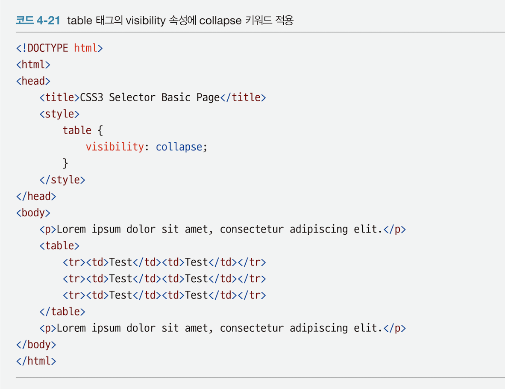
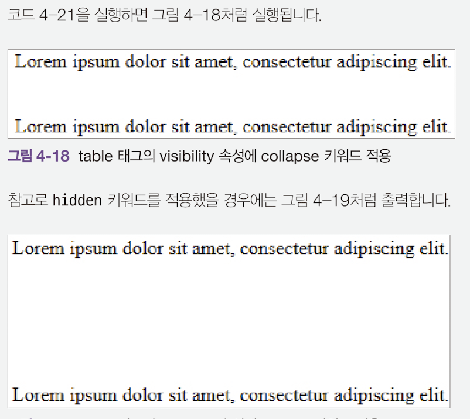

## display속성에 사용가능한 키워드
|키워드 이름|설명
|---|---
|none | 태그를 화면에서 보이지 않게 만든다 |
|block| 태그를 block 형식으로 지정한다.
|inline| 태그를 inline형식으로 지정한다.
|inline-block| 태그를 inline-block형식으로 지정한다.

### 1. none키워드

 

태그가 화면에서 보이지 않는다.

 

### 2. inline, inline-block키워드차이

 

inline키워드는 width, height속성이 적용되지 않는다.

inline-block키워드는 width, height속성이 적용된다.

  

## visibility 속성에 사용 가능한 키워드

| 키워드이름 | 설명 |
|--|--|
| visible | 태그를 보이게 만든다.
| hidden | 태그를 보이지 않게 만든다.
| collapse | table태그를 보이지 않게 만든다.

### 1. collapse 키워드

 

IE, firefox에서만 작동하는 table태그에 사용되는 키워드이다.

 

 

collapse 키워드를 적용하면 table태그가 차지하는 영역 자체가 없어지지만 hidden 키워드를 적용한다면 영역은 그대로 남겨두고 보이지만 않게 된다.

 
 

## opacity속성

 

opacity속성은 태그의 투명도를 조절하는 스타일 속성이다.

opacity 속성은 0.0 ~ 1.0사이의 숫자를 입력가능하다.

 투명 ~~ 불투명사태를 나타낸다.