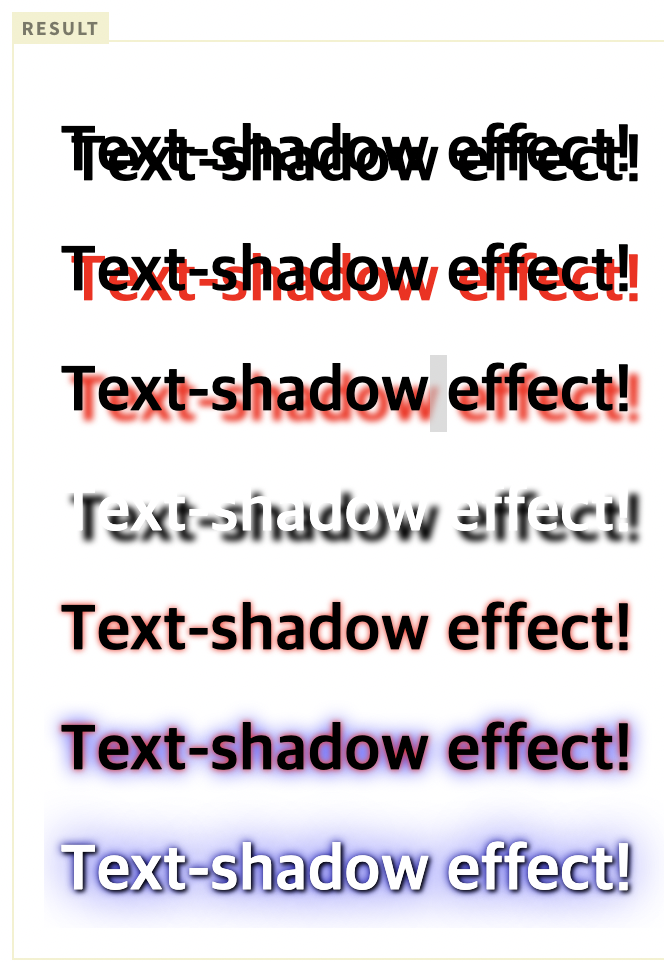

# text-shadow

텍스트에 그림자 효과를 부여하는 프로퍼티다

```css
text-shadow : Horizontal-offset Vertical-offset Blur-Radius Shadow-Color;
```

- Horizontal-offset : 단위(px), 그림자를 텍스트의 오른쪽으로 지정값만큼 이동시킨다.
- Vertical-offset : 단위(px), 그림자를 텍스트의 아래로 지정값만큼 이동시킨다.
- Blur-Radius : 단위(px), 그림자의 흐림정도를 지정한다. 지정값만큼 그림자가 커지고 흐려진다.
- Shadow-Color : color(단위), 그림자의 색상을 지정한다.


>예시1

```html
<!DOCTYPE html>
<html>
<head>
  <style>
    h1:nth-child(1) {
      text-shadow: 5px 5px;
    }
    h1:nth-child(2) {
      text-shadow: 5px 5px red;
    }
    h1:nth-child(3) {
      text-shadow: 5px 5px 3px red;
    }
    h1:nth-child(4) {
      color: white;
      text-shadow: 5px 5px 3px black;
    }
    h1:nth-child(5) {
      text-shadow: 0 0 3px red;
    }
    /*Multiple Shadows*/
    h1:nth-child(6) {
      text-shadow: 0 0 3px red, 0 0 10px blue;
    }
    /*Multiple Shadows*/
    h1:nth-child(7) {
      color: white;
      text-shadow: 1px 1px 2px black, 0 0 25px blue, 0 0 5px darkblue;
    }
  </style>
</head>
<body>
  <h1>Text-shadow effect!</h1>
  <h1>Text-shadow effect!</h1>
  <h1>Text-shadow effect!</h1>
  <h1>Text-shadow effect!</h1>
  <h1>Text-shadow effect!</h1>
  <h1>Text-shadow effect!</h1>
  <h1>Text-shadow effect!</h1>
</body>
</html>
```

