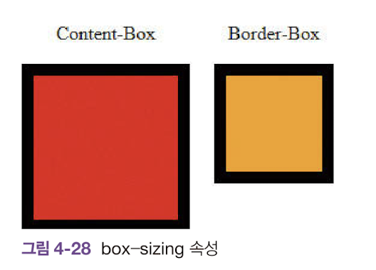

# box-sizing

width, theght속성은 글자를 감싸는 영역의 크기를 지정하는 스타일 속성이다.

box-sizing은 이런 공식을 변경할 수 있는 CSS3 속성이다.

**box-sizing은 width, height속성이 차지하는 범위를 지정해준다.**

```html
<!DOCYTYPE html>
<html>
    <head>
        <title>CSS3 Property Basic</title>
        <style>
            div {
                margin: 10px; padding:10px; width:100px; height:100px; border: 10px solid black;
            }
            div:first-child {
                background: red; box-sizing: content-box;
            }
            div:last-child{
                background: orange; box-sizing: border-box;
            }
        </style>
    </head>
    <body>
        <div></div>
        <div></div>
    </body>
</html>
```

<br>
<br>



<br>
<br>

content-box는 기본으로 적용되는 키워드이다.

content-box를 적용하면 width, height속성이 글자가 들어가는 영역의 크기를 지정하게 한다.

> 박스너비 = width + 2 x (margin+border+padding)
> 
> 박스높이 = height + 2 x (margin+border+padding)

<br>
<br>

border-box 키워드는 width, heigth속성이 테두리를 포함한 영역의 크기를 지정하게 한다.

> 박스너비 = width + 2 x (margin)
>
> 박스높이 = heigth + 2 x (margin)

<br>
<br>

이런 속성특징으로 빨간색 사각형이 노란색보다 큰 이유다.