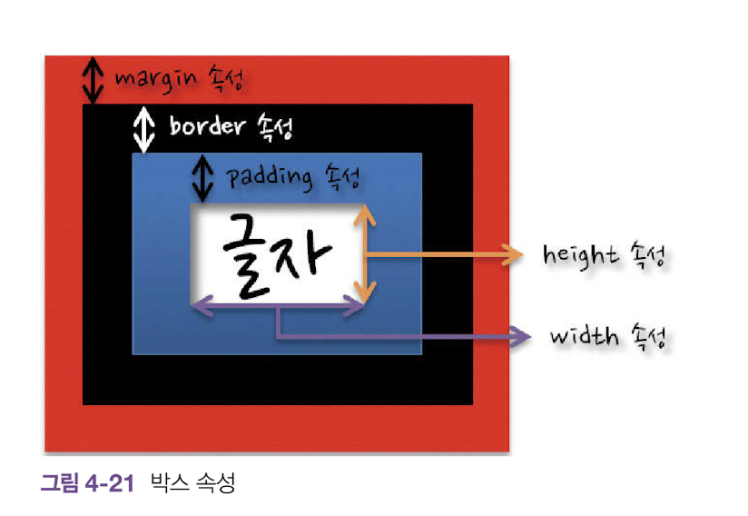
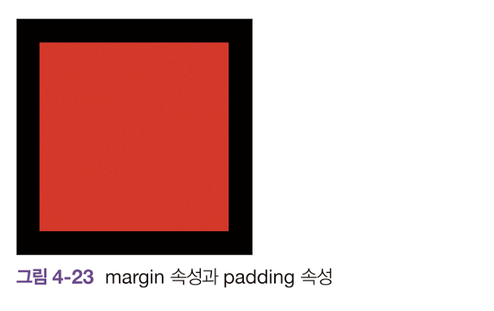

# 박스속성

<br>



<br>
<br>

## width 속성, height 속성

<br>

width, height 속성은 글자를 감싸는 영역의 크기를 지정하는 스타일 속성이다.

<br>
<br>

## margin속성, padding속성

<br>

margin속성은 마진의 너비를 지정,

padding속성은 패딩의 너비를 지정하는 속성이다.

```html
<!DOCTYPE html>
<html>
    <head>
        <title>CSS Property Basic</title>
        <style>
            div {
                width: 100px;
                height: 100px;
                background-color: red;
                border:20px solid blac;
                margin: 10px;
                padding: 30px;
            }
        </style>
    </head>
    <body>
        <div></div>
    </body>
</html>
```

<br>

### 출력물



<br>
<br>


>태그 전체의 크기를 나타내는 공식
>
>전체 너비 = width + 2 x (margin + border + padding)
>
> 전체 높이 = height + 2 x (margin + border + padding)

<br>
<br>

margin, padding 속성은 위,오른쪽,밑,왼쪽(시계방향)을 각각 지정이 가능하다.

```css
margin : [margin-top] [margin-right] [margin-bottom] [margin-left];

또는

margin : [margin-top,bottom]  [margin-left, right];

```

