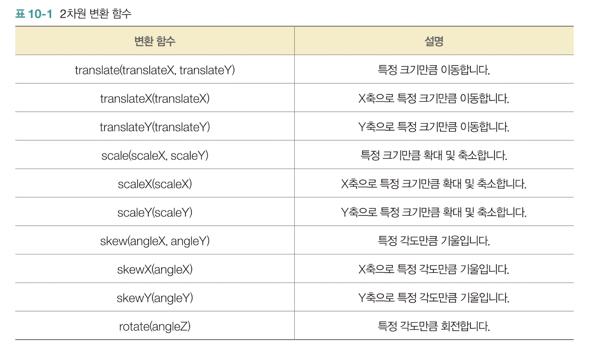
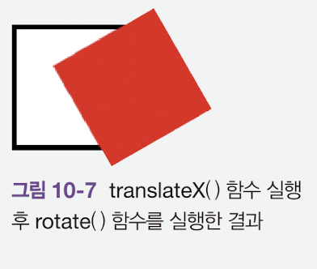
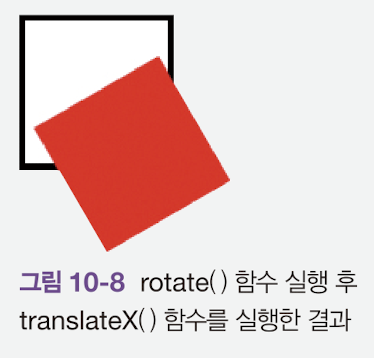

# 2차원 변환

대부분의 컴퓨터는 화면 좌표를 사용한다.


그림처럼 왼쪽 위에 위치하는 점이 영점이며 오른쪽과 아래로 갈수록 크기가 증가한다.

여기서 z축을 추가한다면 3차원 화면좌표로 확장이된다.

## 2차원 변환 함수

언어에서 식별자 뒤에 괄호가 있다면 해당 식별자를 함수라고 부른다.

<br>



많은 변환 함수가 존재한다. transform 속성에 각각 함수를 공백으로 구분하여 입력을 한다.

```css
div {
    width:100px;
    height:100px;
    background:red;
    transform:rotate(60deg) scale(1.2) skewY(10deg)
}
```

<br>


<br>

### 변환함수의 순서

transform속성은 입력하는 순서에 따라서 실행결과가 바뀔 수 있다.

순서만 다른 두개의 css코드가 있다.

```css
div {
    width:100px;
    height:100px;
    background:red;
    transform:translateX(50px) rotate(60deg);
}
```

<br>



x축으로 50픽셀을 이동하고 60도 회전함

<br>

```css
div {
    width:100px;
    height:100px;
    background:red;
    transform:rotate(60deg) translateX(50px);
}
```

<br>




60도 회전하고 X축으로 50픽셀을 이동했다.

