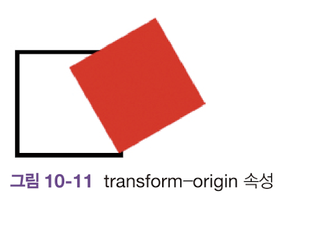

# transform-origin

transform-origin속성은 변환 중심을 설정하는 스타일 속성이다.

```html
<!DOCTYPE html>
<html>
    <head>
        <title>CSS3 Transform Basic</title>
        <style>
            section {
                width:100px;
                height:100px;
                border:5 solid black;
            }

            div {
                width:100px;
                height:100px;
                background:red;
                transform: rotate(60deg);
                transform-origin: 100% 100%
            }
        </style>
    </head>
    <body>
        <section>
            <div></div>
        </section>
    </body>
</html>
```

<br>



transform-origin을 100% 100%를 줬기에 객체의 오른쪽 아래가 변환 중심이된다. 이후 rotate()함수를 실행하여 위와 같은 결과가 도출된다.

