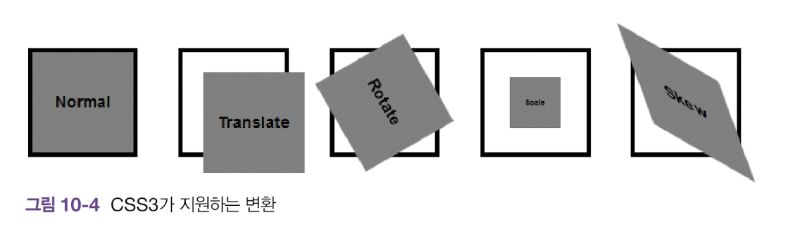
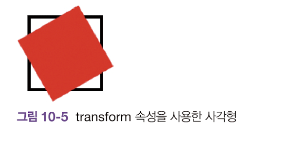

CSS3부터는 transform을 사용하여 객체를 변환할 수 있다.



```html
<!DOCYPE html>
<html>
    <head>
        <title>CSS3 Transform Basic</title>
        <style>
            section {
                width:100px;
                height:100px;
                border:5 solid black;
            }

            div {
                width:100px;
                height:100px;
                background:red;
                transform: rotate(60deg);
            }
        </style>
    </head>
    <body>
        <section>
            <div></div>
        </section>
    </body>
</html>
```

<br>

위 코드의 결과이다.



