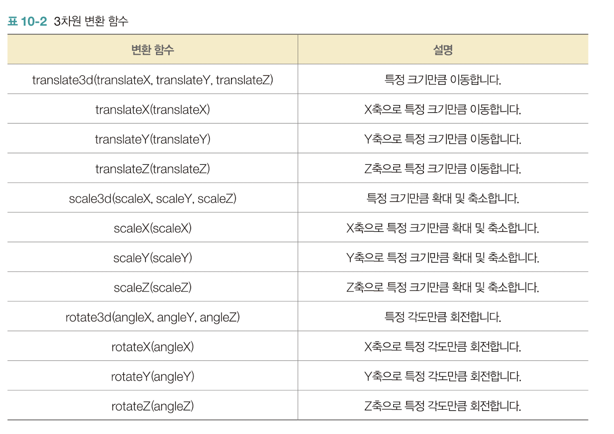

# 3차원 변환 함수



정육면체를 만들기위해 div6개를 만들어서 면6개를 만들어주고 6개를 section태그를 감싸서 하나의 객체를 만들자.

```html
<body>
    <section>
        <div></div>
        <div></div>
        <div></div>
        <div></div>
        <div></div>
        <div></div>
    </section>
</body>
```

```css
<style>
        body{
            width: 200px;
            margin: 200px auto;
        }
        section {
            width: 200px;
            height: 200px;
            position: relative;
            animation: rint 3s linear 0s infinite;

            transform-style: preserve-3d;
        }

        @keyframes rint {
            from{
                transform: rotate(0deg) rotateY(0deg) rotateZ(0deg);
            }
            to{
                transform: rotateX(360deg) rotateY(360deg) rotateZ(360deg);
            }
        }

        div {
            width: 200px;
            height: 200px;
            position: absolute;
            left: 0;
            top: 0;
            opacity: 0.3;
        }
/* 옆면 */
div:nth-child(1) {transform: rotateY(0deg) translate3d(0, 0, 100px); background: red;}
div:nth-child(2) {transform: rotateY(90deg) translate3d(0, 0, 100px); background: green;}
div:nth-child(3) {transform: rotateY(180deg) translate3d(0, 0, 100px);
background: blue;}
div:nth-child(4) {transform: rotateY(270deg) translate3d(0, 0, 100px);
background: yellow;}

/* 윗, 아랫면 */
div:nth-child(5) {transform: rotateY(0deg) translate3d(0, 0, 100px);
background: brown;}
div:nth-child(6) {transform: rotateY(90deg) translate3d(0, 0, 100px);
background: pink;}

    </style>
```