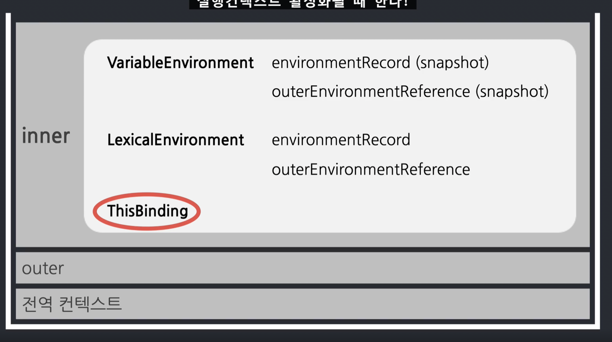

# this

이전에 공부했던 것처럼 thisBinding은 실행컨텍스트가 활성화될 때 한다고 알고 있다.



그리고 실행컨텍스트는 함수가 호출되는 순간 생성된다. 

**즉 thisBinding은 함수가 호출될 때 결정되는 것이다.**

this는 이런 특성을 보아 동적으로 바인딩된다고 알 수 있다.

<br>

## this는 호출하는 방식에 따라서 달라진다.

<br>


<br>

### 전역공간에서의  this

**전역공간에서의 this는 전역 객체를 가리킵니다.**

window(브라우저) / global(node)

자바스크립트의 런타임에 따라서 전역객체의 정보가 달라진다.

<br>

### 함수 호출시 this

**함수 호출시 함수 내부에서 this가 가리키는 것은 전역객체입니다.**

window(브라우저) / global(node)

```js
function a() {
    console.log(this)
};
a();
```

호출한 것을 보면 전역공간에서 그냥 함수 a를 호출한 것이다. 당연히 호출한 대상은 전역 객체가 된다.

<br>

```js
function a() {
    console.log(this);
};
a();

function b() {
    function c() {
        console.log(this)
    };
    c();
}
b();
```

b함수를 호출한 것은 전역객체라고 이해하지만 c함수를 호출한 곳은 b함수 내부이기에 주체가 b라고 생각해야하지 않을까?

이것이 문제라고 생각했기에 ES6에서는 this바인딩을 하지 않는 arrow function이 등장했다.

arrow function은 바로 위의 컨텍스트의 this를 그대로 사용한다.

하지만 **ES5환경에서의 함수에서 호출하는 this는 전역 객체를 가리킨다.**


```js
var d = {
    e : function() {
        function f() {
            console.log(this);
        }
        f();
    }
}

d.e()
```

f함수를 호출하는 this는 무조건 전역객체를 가리킨다. 호출 형태만 보고 판단하면 된다.


<br>

### 메서드 호출시 this

메서드 호출한 주체 (메서드명 앞)이 된다.

```js
var a = {
    b : function() {
        console.log(this);
    }
}
a.b();
```

<br>

위 예제에서는 a.b를 호출하였다. 점 앞인 a가 this이다.

원래는 함수이지만 어떤 객체와 관련된 동작을 하게 된다면 "메서드"라고 부른다.

<br>

```js
var a = {
    b : {
        c: function() {
            console.log(this);
        }
    }
}

a.b.c()
```

c의 this는 a.b까지가 this가 된다.

하지만 .앞이 this대상이 아닌 예외의 경우도 있다.

<br>

```js
obj.func();
obj['func']();
// .은 대괄호표기로도 사용될 수 있다.
// this는 obj가 된다.


person.info.getName();  // getName()이 메서드이고 person.info가 this가 된다.
person.info['getName']();  // ['getName']()이 메서드, person.info가 this가 된다.


person['info'].getName(); // getName()
person['info']['getName']();
```

### 메서드 내함수서의 우회법

```js
var a = 10;
var obj = {
    a: 20,
    b: function() {
        console.log(this.a); // 20

        function c () {
            console.log(this.a); // 10
        }
        c()
    }
}
obj.b();
```
c함수에서 this.a가 10이나온다.

이것을 우회하기 위하여

```js
var a = 10;
var obj = {
    a: 20,
    b: function() {
        var self = this;
        console.log(this.a); // 20

        function c () {
            console.log(self.a); // 10
        }
        c()
    }
}
obj.b();
```
이런식으로 작성한다면 this를 self에 담고 self를 사용하면 해결할 수 있다.

내부함수는 LexicalEnvironment에서 self를 찾고 없으니 outerEnvironment를 이용하여 b함수의 Lexical에서 self를 찾는다.

이때this는 obj.b에 호출할때의 this니까 obj를 가리킨다. 

<br>

ES6에서는 arrow function이 등장했기에 이런 우회법을 사용하지말고 화살표함수를 사용하면 된다.

this를 바인딩하지 않기에 스코프 체이닝 상의 this에 바로 접근할 수 있다.

<br>
<br>

## callback 호출시 this

기본적으로는 함수 내부에서와 동일하다.

> call, apply, bind 메서드에 대해서 알고 넘어가자.

우선 예시코드를 보면서 확인해보자.

```js
function a (x,y,z) {
    console.log(this,x,y,z);
}

var b = {
    bb: 'bbb'
};

a.call(b,1,2,3);

a.apply(b,[1,2,3]);

var c = a.bind(b);
c(1,2,3);

var d = a.bind(b,1,2);
d(3)
```

모두 값은 {bb:"bbb"}1 2 3이라고 출력된다.

<br>

정리

<br>

-> 기본적으로 함수의 this와 같다
-> 제어권을 가진 함수가 콜백의 this를 지정해둔 경우도 있다. (예: addEventListener)
-> 이 경우에도 개발자가 this를 바인딩하여 콜백을 넘기면 그에 따른다.


<br>

## 생성자함수 호출시

새로 만들 인스턴스 객체가 this가 된다.

```js
function Person(n,a) {
    this.name = n;
    this.age = a;
}

var roy = Person('재남', 30); // 생성자 함수로써 호출한 것이 아니고 그냥 함수로써 호출함.. 
console.log(window.name, window.age);  // 재남  30
```

<br>

```js
function Person(n,a) {
    this.name = n;
    this.age = a;
}

var roy = new Person('재남', 30);  // new를 사용하여 생성자 함수로써 호출, 새로 생성될 Person의 인스턴스 객체 자신이 곧 this가 된다.
console.log(roy);
```

