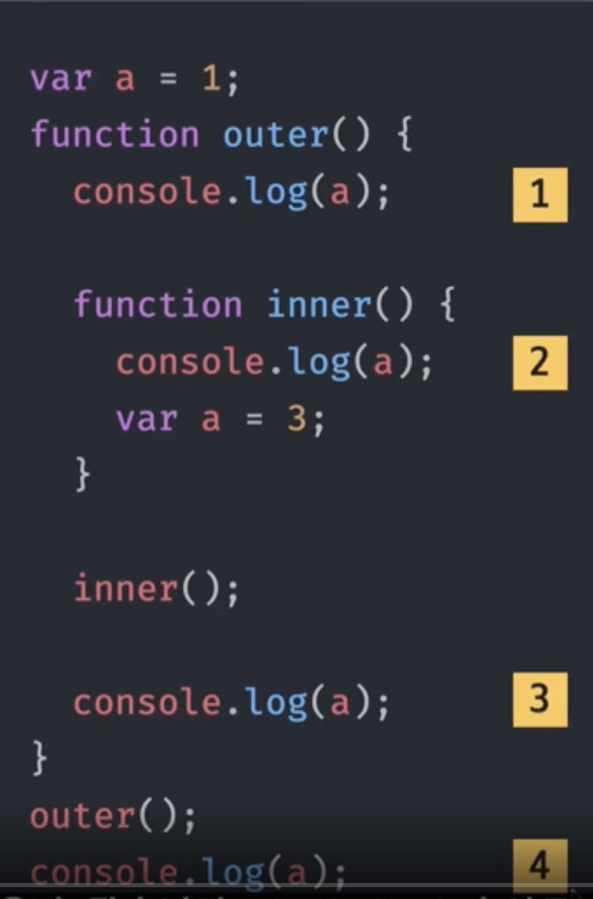
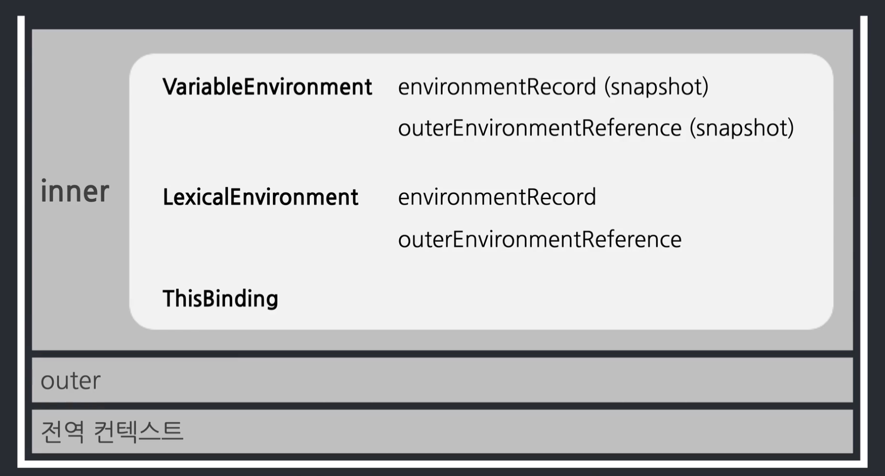
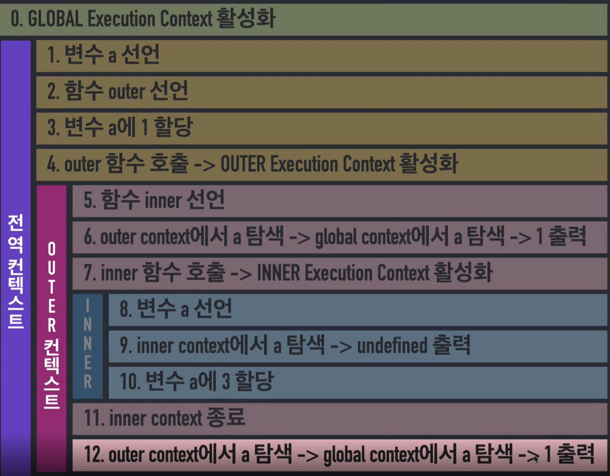
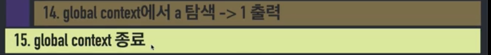

# 실행 컨텍스트 (execution context)

## Context 

코드의 배경이 되는 조건 / 환경

 

## Execution Context?

>코드를 **실행** 하는 데에 필요한 배경이 되는 조건 / 환경이다.

다시말해 동일한 조건 / 환경을 지니는 코드뭉치가 있다고 가정할 때,

이 코드 뭉치를 실행할 때 필요한 조건 / 환경정보 이다.

 

## 동일한 조건 / 환경을 지니는 코드뭉치 ?

자바스크립트에서 동일한 조건/환경을 지니는 코드뭉치는 4가지있다.

- 전역공간
- 함수
- eval (위험한 함수니까 빼자 ^^)
- module

이 3가지 모두(eval제외) 전체 코드가 끝날 때 전역 컨텍스트가 종료되어 하나의 함수라고 봐도 무방하다.

자바스크립트에서 동일한 조건/환경을 지니는 코드뭉치 == 함수

### if, for, switch, while 등 ~문은?

이 ~ 문들은 ES6에서 블록스코프 개념이 추가되어서 let , const에 대하여 독립된 공간으로써 별개의 공간을 부여받지만 **별개의 실행컨텍스트를 생성하지는 않는다**

여기서 가장 중요한 포인트는

**자바스크립트는 오직 함수에 의해서만 컨텍스트를 구분할 수 있다.**

> ***Execution Context(실행컨텍스트) 는 함수를 실행할 때 필요한 환경정보를 담은 객체이다.***

전역 컨텍스트가 열리면서 outer()를 만나 outer함수를 실행한다. (var a는 선언임)

outer함수가 실행되고 outer실행컨텍스트가 열림, console.log(a);를 만나 console에 a가 출력됨.

inner()함수를 만나고 inner함수의 실행컨텍스트가 열린다, console.log(a)를 만나 console에 a가 출력됨.

inner()가 종료되고 outer함수가 계속 진행됨, console.log(a);를 만나 console에 a를 출력함

outer함수가 종료되고 전역컨텍스트가 계속 진행됨, console.log(a);를 만나서 console에 a를 출력함.

 

이처럼 제일 먼저 들어온 것이 제일 나중에 빠지고, 제일 늦게 들어온 것이 제일 먼저 빠지는 것 (FILO)을 스택이라 부르고

코드 실행에 관여하는 스택을 "콜스택"이라고 부른다.

## 콜스택

현재 어떤 함수가 동작중인지, 다음에 어떤 함수가 호출될 예정인지등을 제어하는 자료구조이다.

 

## 실행 컨텍스트 내부

 

 

실행컨텍스트에는 세 가지 환경 정보들이 담긴다.

- VariableEnvironment
- LexicalEnvironment
- ThisBinding

VariableEnvironment는 식별자 정보 수집하는 용도로만 사용되고

LexicalEnvironment는 식별자의 데이터를 추적하는 용도로 사용된다. 그리고 내부를 실행하는 동안에 변수의 값에 변화가 생긴다면 그 변화에 대하여 반영을 한다.

 

## Lexical Environment

Lexical Environment는 어휘적/사전적 환경이라고 부른다.

어떤 실행컨텍스트의 환경정보가 담겨있는 곳이다.

> **실행컨텍스트를 구성하는 환경정보들을 모아 사전처럼 구성한 객체** 이다.

Lexical Environment에는 environmentRecord와 outerEnvironmentReference가 존재한다.

 

### environmentRecord

환경기록, "현재 컨텍스트 내부의 식별자 정보"

Lexical Environment가 **최초실행되자마자 하는 일이 바로 문맥의 식별자 정보를 수집하는일이다.**

이 현상을 좀더 쉽게 이해할 수 있는 방법이 존재하는데..

현재 컨텍스트 식별자 정보들을 수집하여 environmentRecord에 담는 과정을 바로 "호이스팅"이라고 말한다.

 

### 호이스팅

호이스팅은 실제로 존재하는 현상이 아니다.

environmentRecord 정보수집과정을 쉽게 이해하기 위해 만든 허구의 개념이다.

호이스팅(HOISTING)은 "끌어올리다" 라는 뜻이다.

즉 식별자 정보를 실행컨텍스트 맨 위로 끌어올리는 것이다.

 

### outerEnvironmentReference

"외부 환경 참조"

외부 환경은 외부의 Lexical Environment에 대한 참조를 뜻하는 것이다.

> 현재 문맥에 관련있는 외부 식별자 정보를 참조한다.라고 보면 된다.

위 사진을 다시보면 Lexical Environment안에 environmentRecord, outerEnvironmentReference가 존재한다.

이때 outerEnvironmentReference는 outer Lexical Environment를 참조한다.

outer의 outerEnvironmentReference는 전역 Lexical Environment를 참조한다.

이렇게 outerEnvironmentReference가 참조하는것이 **ScopeChain**인 것이다.

> "SCOPE" : 변수의 유효범위

즉 변수의 유효범위는 실행컨텍스트에 의해서 결정된다.

 
 

