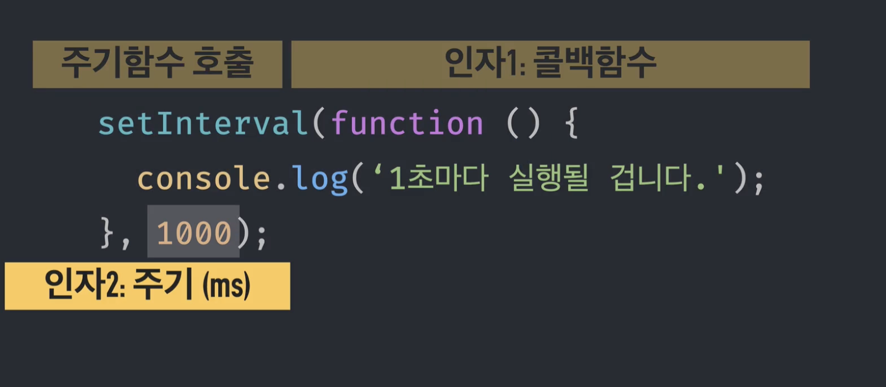

# 콜백함수

callback : 회신하다 / 답신하다.

callback function : 회신하는 함수

<br>


<br>

"이 함수 처리해 주세요" 이 말은 바로 **콜백함수에 대한 제어권을 넘긴다는 뜻이 된다.** 

<br>

## 제어권 위임

1. 실행 시점

setInterval의 예시를 보자



주기함수를 호출하고 인자에 콜백함수와 주기를 입력한다.

```js
var cb = function() {
    console.log('1초마다 실행될 겁니다.')
};

setInterval(cb, 1000);
```
<br>

setInterval의 구조

```js
var intervalID = scope.setInterval(fuc, delay[, param1, param2, ...]);
```
<br>

2. 매개변수

넘겨줄 수 있는 제어권중 '매개변수'도 존재한다.

```js
var arr = [1,2,3,4,5];
var entries = [];

arr.forEach(function(v,i) {
    entries.push([i,v,this[i]]);
}, [10,20,30,40,50]);
console.log(entries);
```

<br>

forEach구문

```js
arr.forEach(callback[, thisArg])

// callback에 올수 있는 요소 : currentValue, index, array
// thisArg : 선택사항, callback을 실행할 때 this로서 사용하는 값
// 반환값 : undefined
```

forEach는 배열에 있는 요소를 순서대로 하나씩 꺼내어 첫번째 매개변수에 값, 두번째 매개변수 index를 부여하여 함수를 실행한다.


<br>

3. this


## 콜백함수의 특징

다른 함수의 인자로 콜백함수를 전달하면, A가 B의 제어권을 갖게된다.

특별한 요청(bind)가 없는한 A에 **미리 정해놓은 방식**에 B를 호출한다.

미리 정해놓은 방식은 어떤 시점에 콜백을 호출할지, 인자에 어떤 값을 지정할지, this에 무엇을 바인딩할지이다.

<br>

### 콜백은 함수이다.

