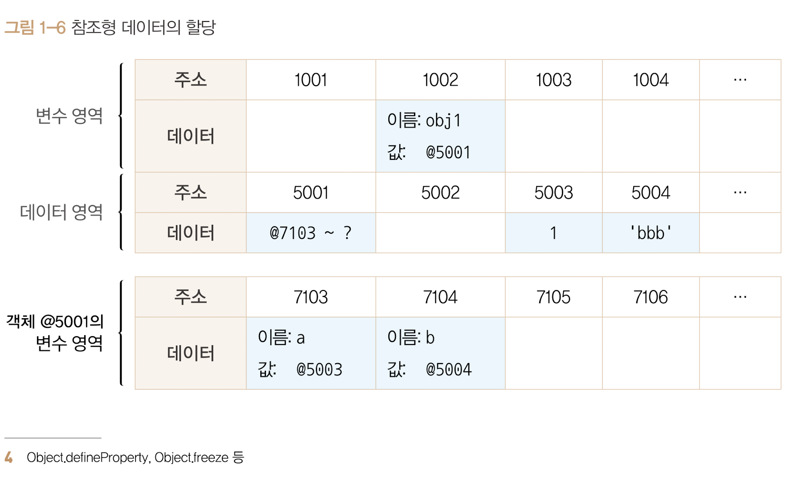

# 가변값

기본형 데이터는 모두 불변값이라고 말했다.

그렇다면 참조형 데이터는 모두 가변값인가?

이에 대한 답변은 "기본적인 성질은 가변값인 경우가 많지만 설정에 따라 변경 불가능한 경우도 있고 불변값으로 활용하는 방법도 있다."라고 말할수 있다.

우선 참조형 데이터의 변수 할당 과정을 보자.

```js
var obj1 = {
    a : 1,
    b : 'bbb'
};
```



<br>

1. 컴퓨터는 변수 영역의 빈 공간(@1002)를 확보, 주소의 이름을 obj1이라고 지정
2. 저장할 데이터가 여러 개의 프로퍼티로 이뤄진 **"데이터 그룹"** 이다. 프로퍼티들을 저장하기 위해 별도의 변수 영역을 마련하고 영역의 주소(@7103 ~ ?)을 @5001에 저장한다.
3. @7103, @7104에 각각 a,b를 프로퍼티 이름을 지정한다.
4. 데이터 영역에서 1을 검색한다. 검색결과가 없기에 @5003에 1을 저장하고 이 주소를 @7103에 저장한다. 'bbb'또한 @7104에 저장한다.


<br>

여기서 볼수 있는 차이점은 **'객체의 변수(프로퍼티) 영역'이 별도로 존재한다는 점이다.**

객체가 별도로 할애한 영역은 변수 영역뿐이다. '데이터 영역'은 메모리 공간을 그대로 활용하고 있다는 점이다.

>데이터 영역에 저장된 값은 모두 불변값이지만 **"변수에는 다른 값을 얼마든지 대입할 수 있다."**

이점이 참조형 데이터는 불변하지 않다(가변값)이다.라고 말하는 것이다.

<br>

```js
var obj1 = {
    a : 1,
    b : 'bbb'
};

obj1.a = 2
```

<br>

위 코드를 살펴보자

obj1의 a 프로퍼티에 2를 할당할려고 한다. 이때 컴퓨터는 데이터영역에 숫자 2를 검색한다. 결과가 없으므로 @5005에 저장하고이 주소를 @7103에 저장한다.

즉 변수 obj1이 보고있는 주소는 @5001이고 변하지 않는다.

**새로운 객체가 만들어 진 것이 아니라 기존의 객체 내부 값만 바뀐다는 것이다.**

