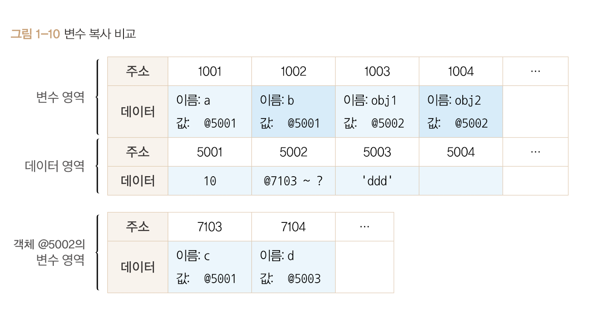
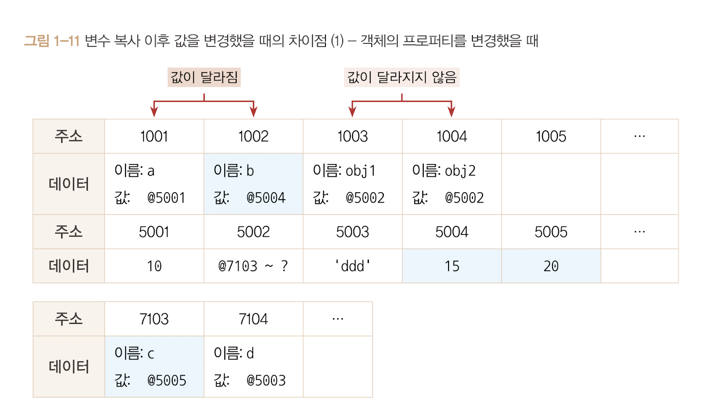
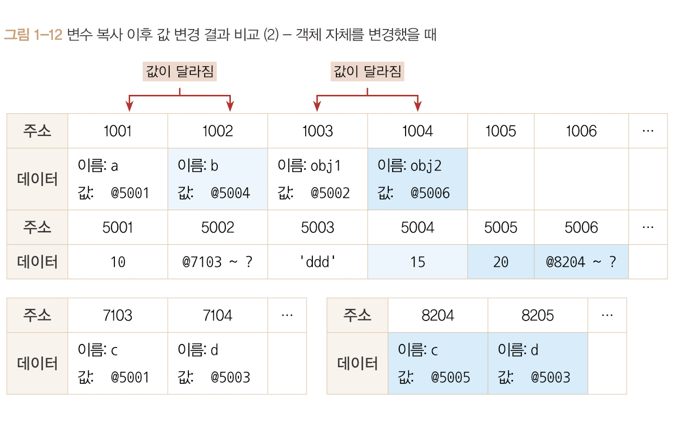

# 변수복사비교

이때까지는 동작방싱에 대해서 공부해왔다. 본격적으로 기본형 데이터와 참조형 데이터의 차이를 확인해보자.

```js
var a = 10;
var b = a;

var obj1 = { c : 10, d : 'ddd'};
var obj2 = obj1;
```

<br>



<br>

### 기본형데이터

<br>

1행에서 변수 영역의 빈공간 @1001을 확보하고 식별자 a로 지정한다.

숫자 10을 데이터 영역에서 검색한다, 없으므로 @5001에 저장한다음 @1001에 넣었다.

이는 기본형 데이터에 대한 변수 선언 및 할당이 종료된다.

<br>

이제는 복사단계를 보자, 

변수 영역의 빈공간 @1002를 확보하고 식별자를 b로 지정한다.

식별자 a를 검색하여 값을 찾아온다. @1001에 저장된 값인 @5001을 들고 확보해둔 @1002에 값으로 대입한다.

<br>

### 참조형데이터

4행에서 변수의 빈공간 @1003을 확보하고 식별자를 obj1으로 지정한다.

데이터 영역의 빈공간 @5002를 확보하고 객체이므로 별도의 변수 영역 (@7103 ~ ?)을 확보하고 주소를 저장한다.

@7103에 c, @7104에 d를 입력하고 c에 대입할 값 10을 데이터 영역에서 검색한다.

10이 이미 존재하기에 재활용하여 @7103에 연결한다.

문자열 'ddd'는 없기에 데이터 영역에 빈 공간을 만들어 @7104에 연결한다.

여기까지가 참조형 데이터의 변수 선언 및 할당이다.

5행의 코드를 본다면 변수 영역에서의 빈공간 @1004를 확보하고 식별자를 obj2로 지정한다.

이제 식별자 obj1을 검색하고 (@1003)의 값인 @5002를 가지고 @1004에 값으로 대입한다.

변수를 복사하는 과정까지는 기본형 데이터와 같다. 하지만 데이터 할당 과정에서 차이가 있기에 변수 복사 이후에도 큰 차이가 발생한다.

<br>

```js
var a = 10;
var b = a;

var obj1 = { c : 10, d : 'ddd'};
var obj2 = obj1;

b = 15;
obj2.c = 20;
```
위 코드를 해석한다면 더 쉽게 알게 될것이다.

6행에서 데이터 영역에 아직 15가 없기에 새로운 공간에 @5004에 저장하고 그 주소를 가지고 식별자 b를 찾는다.

즉 식별자가 b인 @1002의 값은 @5004로 바뀌게된다.

7행에서의 데이터 영역에 20이 없기에 새로운 공간 @5005에 저장하고 그 주소를 가지고 obj2(@1004)를 찾고 obj2의 값(@5002)을 찾고 그안에서 식별자 c를 찾아(@7103)서 값에 @5005를 대입한다.



<br>

기본형 데이터를 복사한 변수 b를 바꿨더니 @1002 값이 달라지지만 참조형 데이터를 복사한 변수 obj2의 값은 바꾸어도 @1004의 값은 달라지지 않는다.

**변수 a,b는 서로 다른 주소를 바라보게 되었지만 obj1, obj2는 같은 객체를 바라보고있다.**

```js
a !== b
obj1 === obj2
```

이 결과가 기본형과 참조형 데이터의 가장 큰 차이점이다.

사실은 어떤 데이터 타입이든 변수에 할당하기 위해서는 주솟값을 복사해야하기에 엄밀히 말해서 **자바스크립트의 모든 데이터 타입은 참조형 데이터일 수 밖에 없다.** 

하지만! 기본형은 주솟값을 복사하는 과정이 한 번만 이뤄지고, 참조형은 한 단계를 더 거치는 차이가 있다.

<br>
<br>

여기서 하나 더 짚고 간다면 내부 프로퍼티의 값을 바꾸지말고 애초에 같은 조건으로 새로운 객체를 할당한다면 어떤 결과가 나오느냐이다.

```js
var a = 10;
var b = a;

var obj1 = { c : 10, d : 'ddd'};
var obj2 = obj1;

b = 15;
obj2 = { c : 20, d :'ddd' }
```
이경우는 메모리의 데이터 영역의 새로운 공간에 새 객체가 저장이되고 주소를 변수의 영역의 obj2위치에 저장한다. 고로 객체에 대한 변경이여도 @1001, @1002처럼 값이 달라진다.

<br>



정리하자면 참조형 데이터가 '가변값'이라고 설명할 때는 참조형 데이터  ***자체를*** 변경할 경우가아니라 ***내부의 프로퍼티를*** 변경할 때만 성립한다.