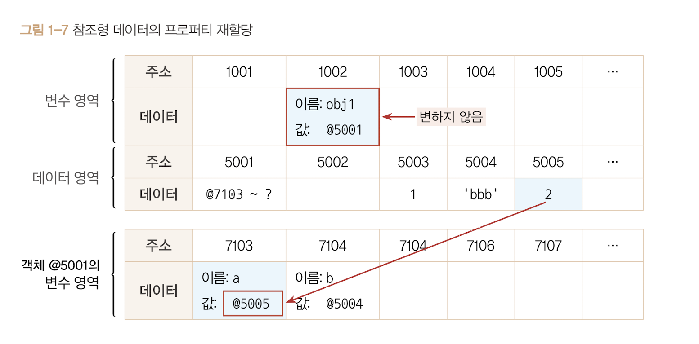
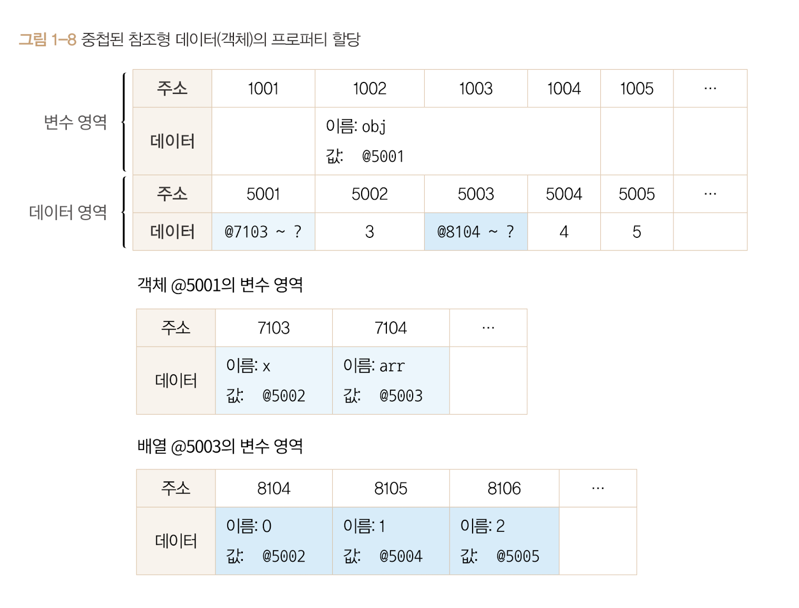

# 불변값

**변수와 상수를 구분하는 성질은 '변경 가능성'**입니다.

바꿀수있다면 변수, 바꿀 수 없다면 상수이다.

변수와 상수를 구분 짓는 대상은 "변수 영역의 메모리"이다.

한번 데이터 할당이 이뤄진  변수 공간에 다른 데이터를 재할당할 수 있는지로 구분이 가능하다.

**불변성 여부**를 구분할 때는 그 대상이 **"데이터 영역"** 의 메모리이다.

기본형 데이터 중 숫자, 문자열, boolean, null, undefined, Symbol 전부다 불변값이다.

<br>

예제코드

```js
var a = 'abc';
a = a + 'def';

var d = 5;
var c = 5;
b = 7;
```

1,2행의 코드를 본다면 변수 a에 문자열 'abc'를 항당, 이후 'def'를 추가하면 새로운 문자열 'abcdef'를 만들고 , 그 주소를 변수 a에 저장한다.

이말은 'abc', 'abcdef'는 완전히 다른 데이터라는 말이다.

<br>

4행 코드를 보자면, 변수 b에 숫자 5를 할당한다. 컴퓨터는 5를 찾고 없다는 것을 인지 후 데이터 공간을 하나 만들어서 저장하고 저장한 주소를 b에 저장한다.



이후 5행에서 변수 c에 5를 할당할려고 할때 이전에 저장한 5의 주소를 재활용한다.

6행에서는 변수 b 값을 7로 바꾸려고한다. 이렇다면 컴퓨터는 우선 7을 찾고 없다면 새로 만들어 b에 저장한다.

즉 문자열, 숫자 값은 다른 값으로 변경할 수 없다.

이것이 불변값의 성질이다. 한 번 만들어진 값은 가비지 컬렉팅을 당하지 않는 한 영원히 변하지 않는다.


<br>
<br>

이번에는 참조형 데이터의 프로퍼티에 다시 참조형 데이터를 할당할 경우를 보자.

이런 경우는 중첩 객체(nested object)라고 불리운다.

<br>

```js
var obj = {
    x : 3,
    arr : [3,4,5]
}
```

<br>



<br>

1. 컴퓨터는 변수영역 빈 공간(@1002)을 확보하고 주소 이름을 obj로 지정한다.
2. 이 데이터는 객체로 각 변수(프로퍼티)를 저장하기 위해서 별도의 변수 영역을 마련(@7103 ~ ?)하고 그 영역주소를 @5001에 저장한다.
3. @7103에 이름 x, @7104에 이름 arr를 지정한다.
4. 데이터 영역에서 3을 검색한다. 없으므로 @5002에 3을 저장하고 이 주소를 @7103에 저장한다.
5. @7104에 저장할 값은 배열이다. 고로 데이터 그룹이므로 별도의 변수 영역을 마련(@8104 ~ ?), 영역 주소 정보를 @5003에 저장하고 @5003을 @7104에 저장한다.
6. 배열요소가 총 3개라 3개의 변수 공간을 확보하고 인덱스를 부여해준다.
7. 데이터 영역에서 3을 검색해서 주소를 @8104를 부여
8. 데이터 영역에서 4를 검색한다. 없으므로 @5004에 저장하고 주소를 @8105에 저장한다.
9. 데이터 영역에서 5를 검색한다. 없으므로 @5005에 저장하고 주소를 @8106에 저장한다.

<br>

자 여기서 obj.arr[1]을 검색한다고 가정한다. 메모리에서의 과정을 살펴보자

1. obj 검색 1 : obj가는 식별자를 가진 주소를 찾는다(@1002)
2. obj 검색 2 : 값이 주소라서 해당 주소로 이동한다.(@5001)
3. obj 검색 3 : 값이 주소라서 해당 주소로 이동한다.(@7103 ~ ?)
4. obj.arr 검색 1 : arr라는 식별자를 가진 주소를 찾는다.(@7104)
5. obj.arr 검색 2 : 값이 주소라서 해당 주소로 이동한다.(@5003)
6. obj.arr 검색 3 : 값이 주소라서 해당 주소로 이동한다.(@8104~?)
7. obj.arr[1] 검색 1 : 인덱스 1에 해당하는 주소를 찾는다.(@8105)
8. obj.arr[1] 검색 2 : 값이 주소라서 해당 주소로 이동한다.(@5004)
9. obj.arr[1] 검색 3 : 값이 숫자형 데이터라 4를 반환한다.

<br>

> @1002 -> @5001 -> (@7103 ~ ?) -> @7104 -> @5003 -> (@8104 ~ ?) -> @8105 -> @5004 -> 4반환

<br>

이때 재할당을 한다면
```js
obj.arr = 'str'
```

@5006에 'str'을 저장하고 주소를 @7104에 저장, 이때 @5003의 참조 카운트가 1이였다가 0으로 바뀌면서 가비지 컬렉터의 수거대상이된다.

이후 @8104~? 라는 값은 사라지고 @8104~?의 각 데이터 참조카운트가 0이 되고 이들도 가비지컬렉터에 의해서 사라질것이다.

