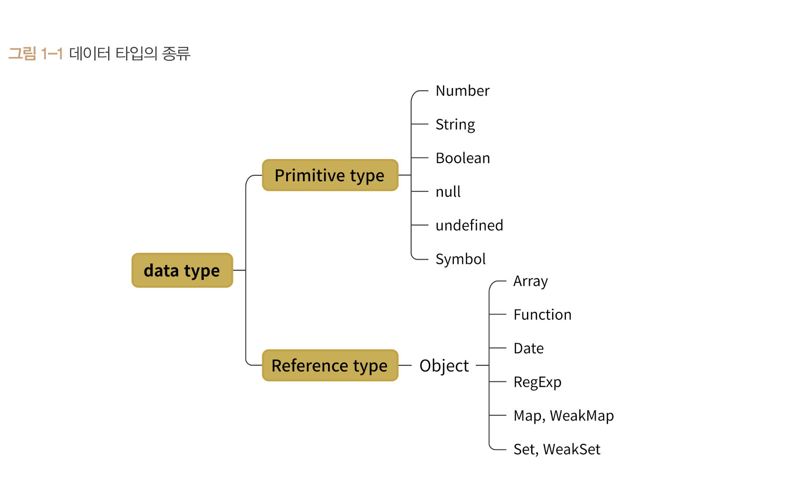

# 데이터타입의 종류

- 기본형 (primitive type, 원시형이라고도 불림)
- 참조형 (reference type)

 

 

> 기본형
> 
> 숫자, 문자열, 불리언, null, undefined, symbol

 

> 참조형
>
> 객체, 배열, 함수, 날짜, 정규표현식, Map, WeakMap, Set, WeakSet
>

 

## 기본형과 참조형 구분점

 

1. 할당이나 연산시 

기본형은 주솟값을 바로 복제, 

참조형은 값이 담긴 주솟값들로 이룬 묶음를 가리키는 주솟값을 복제하는 것.

2. 불변성 (immutability)

기본형은 불변성을 띈다.

