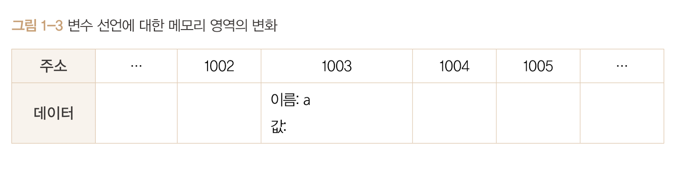
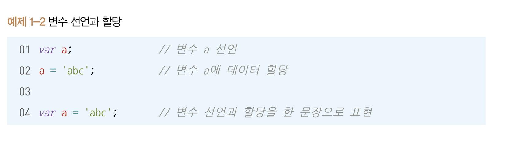
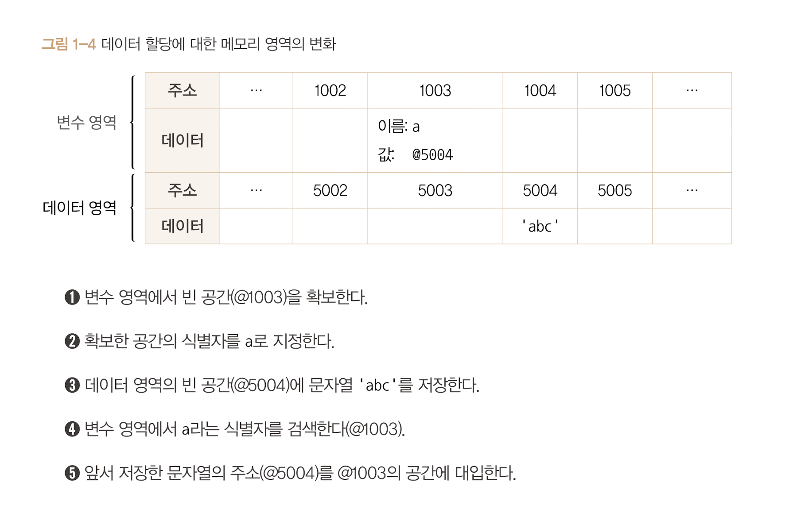
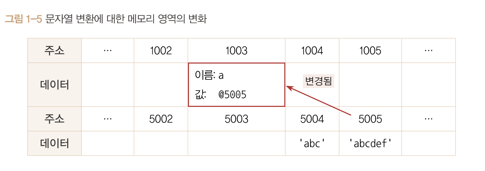

# 변수선언

기본적인 변수 선언식

```javascript
var a;
```

**"변할 수 있는 데이터를 만든다. 이 데이터의 식별자는 a로 한다"** == **"변경 가능한 데이터가 담길 수 있는 공간 또는 그릇"**


<br>



<br>

var a; 으로 변수를 선언 한다면 위 그림과 같이 1003공간에 a를 지정한다.

<br>

## 데이터 할당



<br>

자바스크립트 엔진은 var a, var a = 'abc'로 명령하든 같은 동작을 수행한다.

변수를 선언 후 a 라는 이름을 가진 주소를 검색해서 문자열 'abc'를 할당한다.

<br>

## 데이터 할당에 대한 메모리 영역의 변화



<br>

위 문자열 'abc'의 마지막에 'def'를 추가한다고 한다면 컴퓨터는 @5004 공간에 'abcdef'로 바꾸는 대신 'abcdef'라는 문자열을 **새로**만들어 별도의 공간(@5005)에 저장하고 변수 공간에 연결한다.



<br>

즉, 기존 문자열에 어떤 변환을 가하든 상과없이 **무조건 새로 만들어 별도의 공간에 저장한다.**
