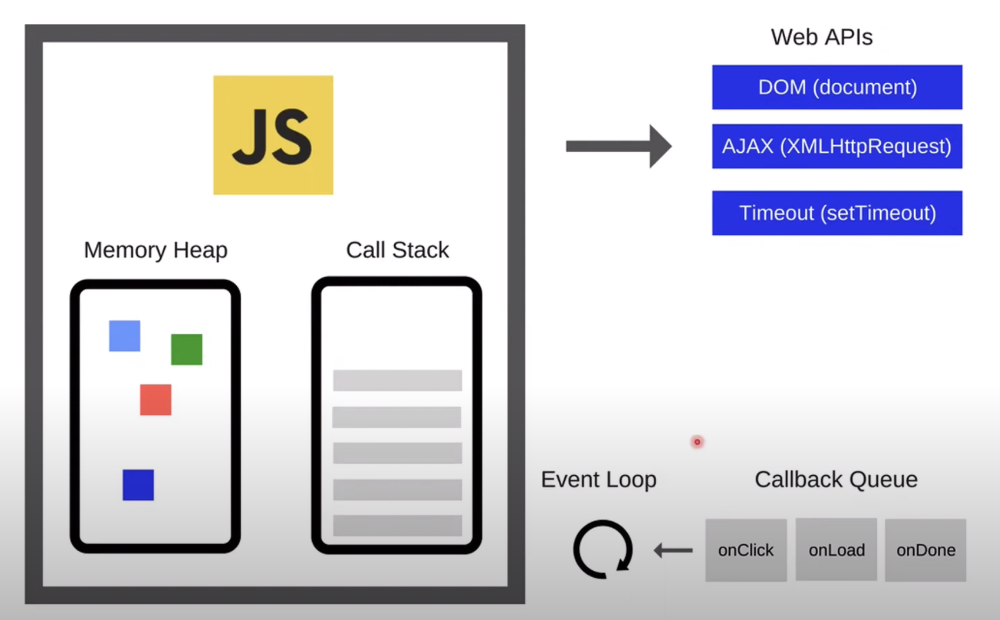
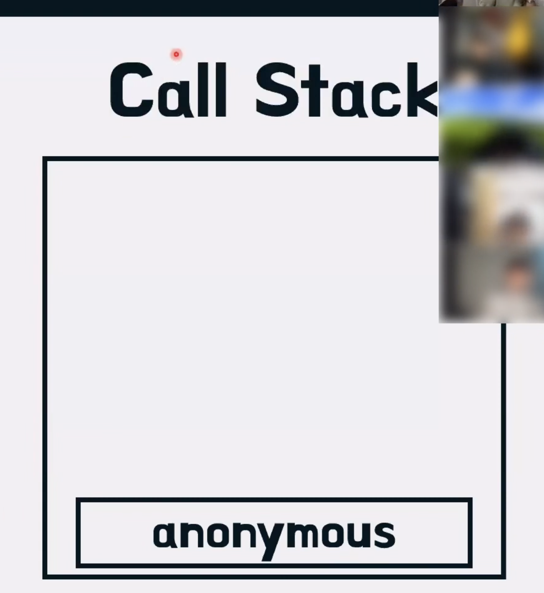
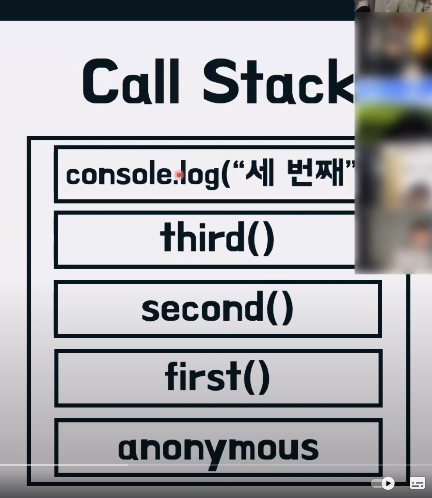

# Call Stack



<br>

예시코드

```javascript
function first() {
    second();
    console.log("첫 번째")
}
function second() {
    third();
    console.log("두 번째")
}
function third() {
    console.log("세 번째")
}

first();
third();
```

위 코드의 실행순서를 예상해보자.

"세 번째", "두 번째", "첫 번째", "세 번째"라고 나는 생각했다.

<br>

자 이제 그림을 보면서 알아보자.



<br>

콜스택은 "anonymous"를 기본적으로 쌓이고 이후 실행순서대로 콜스택이 쌓인다.

<br>



<br>

이후 first()가 실행되었고 console.log("세번째")까지 콜스택에 쌓인 후 실행된 결과인 는  console.log("세번째")와 third() 빠져나간다..

<br>

이후 이후 second함수를 보았떠니 third()는 실행완료했지만 console.log('두 번째')가 있기에 콜스택에 console.log('두 번째')이 쌓이고 실행완료 후 빠져나가고 second도 콜스택에서 빠져나간다.

firtst()도 같이 console.log('첫 번째')를 실행시키고 콜스택에서 빠져나간다.

이후 third()가 콜스택에 담기고 console.log('세번째')를 출력시키고 콜스택에서 빠져나가고 third()도 콜스택에서 빠져나간다. 

<br>

콜스택은 이처럼 실행하는 것을 명심하자