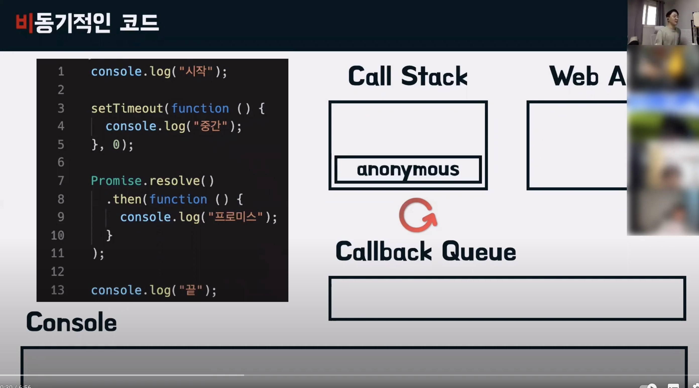
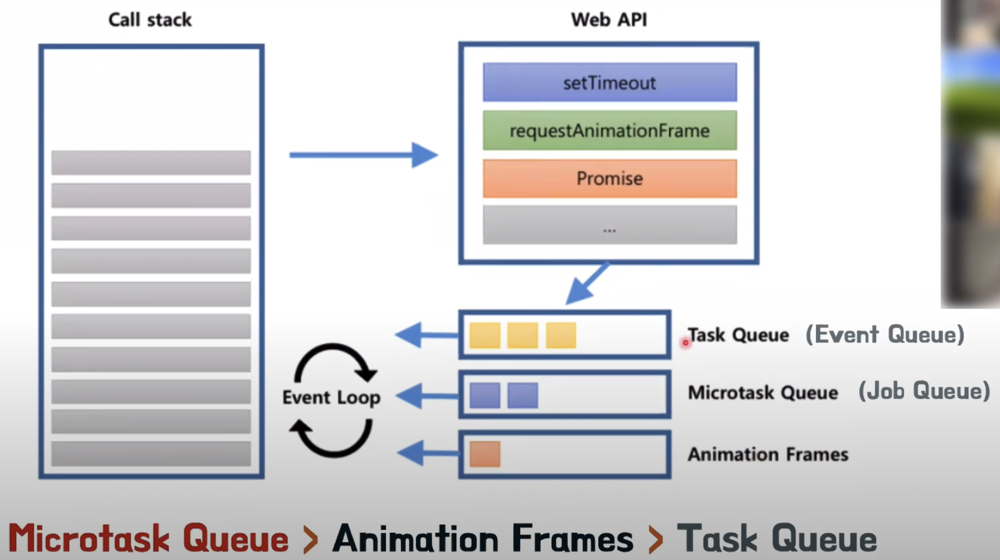

# priomise는 어떻게 처리할까?

 

예시코드

 

위 코드의 결과를 예상해보자.

"시작", "끝", "프로미스", "중간" 이라고 예상했다.

> 실행과정

콜스택에 anonymous가 쌓이고 console.log('시작')이 쌓인다.

Console에 '시작'이 출력되고 콜스택의 console.log('시작')은 빠진다.

setTimeout이 콜스택에 쌓이고 비동기 함수이기때문에 WebAPI로 넘어간다.

Promise가 콜스택에 쌓인다. 

 

>!! 여기서 중요점 **Promise는 비동기가 아니다! 엄밀히 말하자면 Promise는 동기적 코드이다.**
> Promise는 then을 만나는 순간! 비동기로 동작을 하게 된다.

 

다시 과정으로 넘어와서 Promise가 콜스택에 쌓였고 엔진은 이것은 비동기로 인식하여 WebAPI로 넘겨준다.(넘어갈때 then)

이후 console.log('끝')이 콜스택에 쌓인다.

엔진마다, 브라우저마다 차이가 있겠지만 여기서는 setTimeout이 먼저 동작하다는 가정.

setTimeout이 Callback Queue로 넘어가고 이후 then(Promise였던것)이 넘어간다.

Console에 "끝"이 출력되고 콜스택에서 console.log("끝")이 빠져나간다.

콜스택의 anonymous도 빠져나간다.

계속 활성화 되어있던 이벤트루프가 콜스택이 비어있다는 것을 인지후 Callback Queue에 있는 then을 먼저 콜스택에 올린다. **(우선순위가 then이 높다.)**

Promise익명함수에서 console.log("프로미스")를 콜스택에 올리고 실행 Console에 출력 후 콜스택에서 빠져나가고  then까지 빠져나간다.

이벤트루프가 콜스택이 비어있다는 것을 인지후 Callback Queue에 있는 setTimeout 익명함수를 콜스택에 올린다. 

console.log('중간')이 콜스택에 쌓이고 Console에 "중간"이 출력되고 콜스택에서 빠져나간 후  console.log('중간')도 빠져나간다.

  

## Callback Queue의 우선순위

 

사진을 보다시피 callback queue는 Microtask Queue, Animation Frames(Job Queue), Task Queue(Event Queue)로 나뉘어져있다.

이때 setTimeout은 task queue이고, Promise는 Microtask Queue이기때문에!

위 코드에서 콜스택을 먼저 올린 이유는 이러한 우선순위가 있기 때문이다.