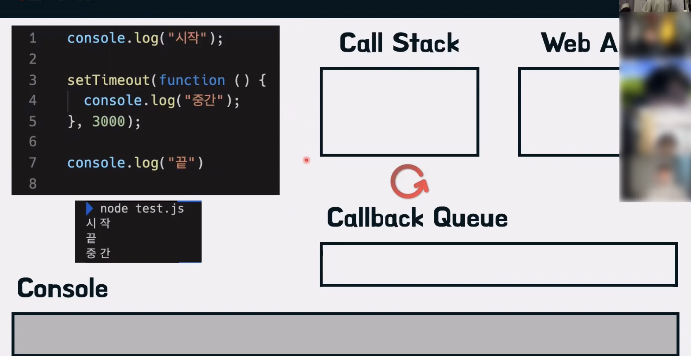
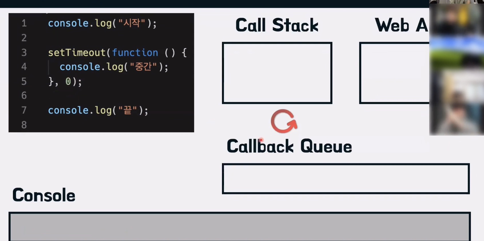

# 비동기적 코드

 

예시코드

 

위 코드를 실행한 결과를 예상해보자

"시작", "끝", "중간"이라고 생각한다.

 
 

우선 콜스택부터 보자

> 실행순서

anonymous가 콜스택에 우선적으로 쌓이고
console.log("시작")가 콜스택에 쌓인다.

이후 Console에 "시작"이 출력되고 콜스택에서 console.log('시작')이 빠진다.

setTimeout함수가 콜스택에 쌓이고 setTimeout이 실행되면서 WebAPI로 넘어가게 되고 동시에 console.log('끝')이 콜스택에 쌓인다.

setTimeout 3초가 지나고 있는 시점에 Console에 "끝"이 출력되고 차례대로 anonymous가 실행되어 콜스택에서 빠진다.

이후 WebAPI있는 setTimeout이 3초가 지나고 Callback Queue에 넘겨준다.

이후 이벤트 루프가 콜스택을 검사하고 콜스택이 비어있다는 것을 인지하고 콜백 큐에 있는 setTimeout을 콜스택에 쌓는다.

이후 setTimeout함수 안에있는 console.log('중간')을 콜스택에 쌓고 실행시킨다.

Console에 "중간"이 표기되고 콜스택에서는 console.log('중간')이 빠지고 setTimeout도 콜스택에서 빠진다.

 

비슷한 예시를 하나 더 보자.

 

이 코드 또한 "시작", "끝", "중간"으로 실행결과가 나온다.

> 실행결과

이전 코드 실행과정중 setTimeout이 나오기 전까지는 동일하다.

setTimeout 함수가 콜스택에 쌓이고 0초이기때문에 바로 WebAPI로 넘어간다.

콜스택에 console.log('끝')이 쌓이게되고 WebAPI에서 setTimeout은 Callback Queue로 넘어가게된다.

 

여기서 주의점!!!은  끝이 먼저 실행되어 Console에 담기느냐, WebAPI에서 Callback Queue로 넘어가는게 먼저냐 라는 기준은 **실행엔진 또는 브라우저마다 다를 수 있다**

 

Console에 "끝" 이 출력되고 콜스택에서 console.log("끝")이 빠져나온다.

anonymous도 콜스택에서 빠져나온다.

이벤트 루프는 콜스택이 비어있는 것을 인지하고 Callback Queue에 있는 setTime함수를 콜스택에 쌓는다.

console.log('중간')을 콜스택에 쌓고 Console에 "중간"이 출력되고 console.log('중간')은 콜스택에서 빠져나간다.

setTimeout함수도 콜스택에서 빠져나간다.