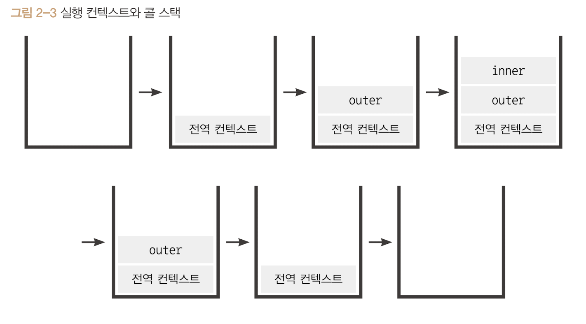

# 실행컨텍스트

실행할 코드에 제공할 환경 정보들을 모아놓은 객체

자바스크립트의 동적 언어로써 성격을 가장 잘 파악할 수 있는 개념

자바스크립트는 어떤 실행 컨텍스트가 활성화되는 시점에 호이스팅이 이뤄지고, this값을 설정하는 등 많은 동작이 실행된다. 이를 자세히 알려면 실행컨텍스트는 반드시 공부해야한다.

실행컨텍스트는 자바스크립트에서 핵심 개념이다.

<br>

## 스택과 큐

**스택**은 출입구가 하나뿐인 우물과 같은 데이터 구조이다.

a,b,c,d순서로 데이터를 저장했다면 d,c,b,a로 꺼낼 수 밖에 없다.(LIFO)

**큐**는 양쪽이 열려있는 파이프를 생각하자.

한쪽은 입력만 한쪽은 출력만 담당하는 구조를 말한다.

a,b,c,d를 저장했다면 a,b,c,d 순서로 꺼낸다 (FILO)

<br>

실행 컨텍스트를 다시 정의하자면 **실행할 코드에 제공할 환경 정보들을 모아놓은 객체** 이다.

동일한 환경에 있는 코드를 실행할 때 필요한 환경 정보를 모아 컨텍스트를 구성하고, 이를 콜 스택에 쌓아올렸다가 가장 위에 쌓여있는 컨텍스트와 "동일한 환경"에 있는 코드를 실행하는 식으로 진행한다.

위에서 말한 "동일한 환경"이란 하나의 실행 컨텍스트를 구성할 수 있는 방법은 전역공간, eval()함수, 함수 등이 있다.

**실행컨텍스트를 구성하는 방법은 함수를 실행하는 것 뿐이다.**

<br>

```js
// ------------------------ (1)
var a = 1;
function outer() {
    function inner() {
        console.log(a); // undefined
        var a = 3;
    }
    inner(); // --------------------- (2)
    console.log(a) // 1
}

outer(); // ---------------(3)
console.log(a); // 1
```



여기에서 담기는 정보는 다음과 같다.

- VariableEnvironment : 현재 컨텍스트 내의 식별자들에 대한 정보 + 외부 환경 정보, 선언 시점의 LexicalEnvironment의 스냅샷으로, 변경 사항은 반영되지 않는다.
- LexicalEnvironment: 처음에는 VariableEnvironment와 같지만 변경사항이 실시간으로 반영된다.
- ThisBinding: this 식별자가 바라봐야 할 대상 객체.