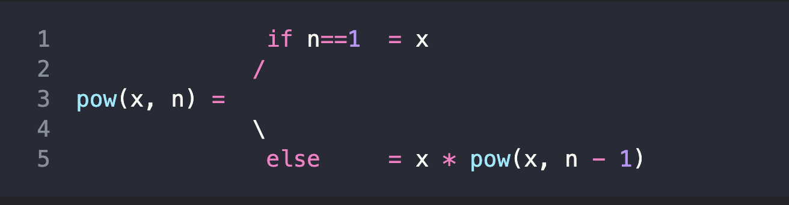

# 재귀

재귀는 큰 목표 작업 하나를 동일하면서 간단한 작업을 여러 개로 나눌 수 있을때
유용한 프로그래밍 패턴이다.

함수가 자기 자신을 호출할 때가 있는데 이를 **"재귀"** 라고 부른다.

## 사고방식

x를 n제곱해주는 함수 pow(x,n)을 만들어보아라.

이때 생각할수 있는 사고방식 두 가지가 있다.

1. 반복적인 사고를 통한 방법 : for루프
2. 재귀적인 사고를 통한 방법 : 자기 자신을 호출하는 방법

1번같은 경우 아래와 같은 코드를 작성한다.

```js
function pow(x,n) {
    let result = 1;
    // 반복문을 돌면서 x를 n번 곱한다.
    for(let i = 0; i < n; i++) {
        result *= x;
    }
    return result;
}

console.log(pow(2,3)); // 8
```

2번같은 경우 아래와 같은 코드를 작성한다.

```js
function pow (x,n) {
    if(n === 1) {
        return x;
    } else {
        return x * pow (x,n - 1);
    }
}
console.log(pow(2,3)) // 8
```

2번 코드를 자세히 보자.

pow(x,n)을 호출하면 아래와 같이 코드가 실행된다.



<br>

1. n === 1일때, 명확한 결괏값을 즉시 출력하므로 이것을 재귀의 베이스라고 한다.
2. n === 1이 아닐때 ,pow(x,n)은 x * pow(x, n-1)으로 표현할 수 있다. 이를 재귀 단계라고 부르고 pow 는 n === 1이 될 때까지 재귀적으로 자기자신을 호출한다.

<br>

이렇게 재귀를 사용한다면 함수의 호출을 더 간단한 함수 호출로 계쏙 줄일 수 있다는 장점이 있다.

> function pow(x,n) {
> return (n === 1) ? x : (x * pow(x, n-1));
> }
>
> 이런식으로 줄일 수 도 있다.

<br>

재귀란 어떤 것인지 알게되었으니 실행 컨텍스트와 스택에 대해서 알아보자.

link : 재귀의스택
