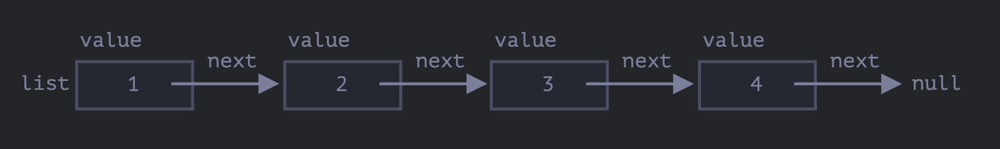

# 재귀적 구조

재귀적으로 정의된 자료구조인 재귀적 자료구조는 자기 자신의 일부를 복제하는 형태의 자료구조이다.

위에서 공부하였던 회사의 부서 객체는 두가지 종류로 나눠지는데

- 사람들로 구성된 배열
- 하위 부서로 이루어진 객체

하지만 어떤 상황에서는 배열대시 연결 리스트를 사용하면 더 좋은 경우가 있다.

## 연결리스트

객체를 정렬하여 어딘가에 저장하고 싶다 라는 생각이 들때는 

가장 먼저 떠오르는 자료구조는 배열일 것이다.

하지만 배열은 '삭제'와 '삽입'에 들어가는 비용이 많다.

arr.unshift(obj)연산을 수행할려고한다면 obj를 위한 공간을 만들기 위해 모든 요소의 번호를 다시 매겨야한다는 문제가 있다.

배열이 커지면 그만큼 연산시간이 더 걸리게되고 arr.shift()를 사용할 때도 마찬가지이다.

요소 전체의 번호를 매기지않고 하는 연산은 arr.push/pop분이다.

빠르게 삽입이나 삭제를 할때 배열대신 연결리스트라는 자료구조를 사용할 수 있다.

<br>

>예시

```js
let list = {
    value: 1,
    next: {
        value: 2,
        next: {
            value: 3,
            next: {
                value: 4,
                next: null
            }
        }
    }
};
```

<br>



<br>

연결리스트는 아래의 코드처럼 작성해도 동일하게 작동한다.

```js
let list = {value : 1};
list.next = {value: 2};
list.next.next = {value: 3};
list.next.next.next = {value: 4};
list.next.next.next.next = null;
```