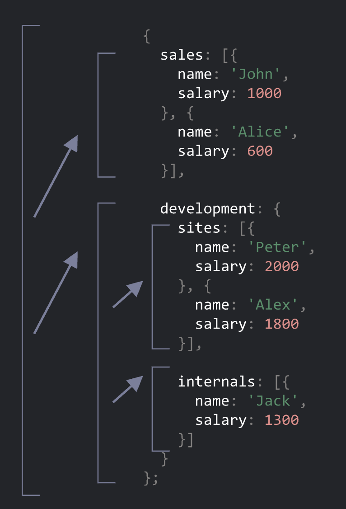

# 재귀적 순회

한 회사가 있다고 가정해보자. 임직원을 객체로 표현해보았다.

```js
let company = {
  sales: [{
    name: 'John',
    salary: 1000
  }, {
    name: 'Alice',
    salary: 1600
  }],

  development: {
    sites: [{
      name: 'Peter',
      salary: 2000
    }, {
      name: 'Alex',
      salary: 1800
    }],

    internals: [{
      name: 'Jack',
      salary: 1300
    }]
  }
};
```

여기서 주의할 점은

- 부서는 하위부서를 가질수 있고 development 부서는 sites, internals라는 하위부서를 가지고 각 하위부서에도 직원들이 있다.
- 하위 부서가 커지면 더 작은 단위와 부서로 쪼개질 가능성이 있다.

이 점을 염두해야한다면 어떤 방법으로 해결할 수 있을까?

반복문을 생각한다면 sites같은 2depth에 속한 급여를 뽑아낼때 다른 중첩반복문이 필요하고, 그 아래의 부서까지 가정한다면 더 많은 중첩반복문이 필요해질 것이다.

재귀를 이용한 풀이법으로 시도해보자.

1. 임직원 배열을 가진 부서
2. N개의 하위 부서가 있는 객체 : 하위 부서에 속한 임직원의 급여 합계를 얻기위해 N번의 재귀호출하고, 모든 하위부서의 임직원 급여를 더한다.

<br>

코드를 읽어 보면서 알고리즘을 이해해보자.

```js
let company = { // 동일한 객체
    sales: [{name: 'John', salary: 1000}, {name: 'Alice, salary:1600'};],
    development: {
        sites: [{name: 'Peter', salary: 2000}, {name: 'Alex', salary: 1800}],
        internals: [{name: 'Jack', salary: 1300}]
    }
};

// 급여 합계를 구해주는 함수
function sumSalaries(department) {
    if(Array.isArray(department)) { // 첫 번째 경우
        return department.reduce((prev, current) => prev + current.salary, 0) // 배열의 요소를 합함
    } else { // 두 번째 경우
        let sum = 0;
        for (let subdep of Object.values(department)) {
            sum += sumSalaries(subdep); // 재귀호출로 각 하위 부서 임직원의 급여 총합을 구한다.
        }
    return sum;
    }
}
console.log(sumSalaries(company)) /// 7700
```



<br>