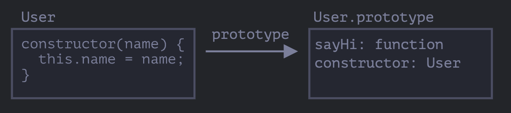

# 클래스

> 클래스는 객체 지향 프로그래밍에서 특정 객체를 생성하기 위해 변수와 메서드를 정의하는 일종의 틀로, 객체를 정의하기 위한 상태(멤버 변수)와 메서드(함수) 로 구성된다.
>

실무에서는 사용자나 물건같이 동일한 종류의 객체를 여러 개 생성해야 하는 경우가 많다.

이럴때 new연산자나, 생성자함수에서 new function을 사용할 수 있다.

여기에 모던 자바스크립트에서 도입된 클래스를 사용하면 더 다양한 기능을 사용할 수 있다.

<br>

## 기본문법

```js
class MyClass {
    // 메서드를 정의할 수 있다.
    constructor() {...}
    method1(){...}
    method2(){...}
    method3(){...}
}
```

이런 식으로 클래스를 만들고 , new MyClass()를 호출한다면 내부에서 정의한 메서드가 들어 있는 객체가 생성된다.

constructor()는 객체의 기본 상태를 설정해주는 생성자 메서드로 new에 의해서 자동으로 호출된다.

즉 특별한 절차 없이 객체를 초기화 할 수 있다.

```js
class User() {
    constructor(name) {
        this.name = name;
    }

    sayhi() {
        console.log(this.name);
    }

}

// 사용법!
let user = new User("John");
user.sayhi();
```

new User("John")을 호출하면 어떤일이 발생할까?

1. 새로운 객체가 생성된다
2. 넘겨받은 인수와 함께 constructor가 자동으로 실행되고, 인수에 "John"이 this.name에 할당된다!

이후 user.sayhi()같은 메서드를 호출이 가능하다.


## 클래스란?

클래스는 자바스크립트에서 새롭게 만든 개체가 아니다.

**자바스크립트에서의 클래스는 함수의 한 종류이다.**

<br>

코드를 보면서 확인해보자.

```js
class User {
    constructor(name) {
        this.name = name;
    }

    sayHi() {
        console.log(this.name)
    }
}

// User가 함수인 증거를 보여주지
console.log(typeof User) // function
```

<br>

class User {...} 문법 구조가 진짜 하는 일은 무엇일까?

1. User라는 이름을 가진 함수를 만든다. 함수 본문은 생성자 메서드인 constructor에서 가져온다. 만약 생성자 메서드가 없으면 비워진 채로 함수가 만들어진다.
2. sayHi같은 클래스 내에서 정의한 메서드를 User.prototype에 저장한다.

<br>

new User를 호출하여 객체를 만들고, 객체의 메서드를 호출하면 메서드를 prototype프로퍼티를 통하여 가져온다.

이런 과정이 있기에 객체에서 클레스 메서드에 접근할 수 있다는 것이다.

class User 선언 결과를 그림은 나타내보자면.



<br>

```js
class User {
    constructor(name) { this.name = name;}
    sayHi() {
        console.log(this.name)
    }
}

console.log(typeof User); // function

// 정확히 말하면 생성자 메서드와 동일하다.
console.log(User === User.prototype.constructor); // true

// 클래스 내부에서 정의한 메서드는 User.prototype에 저장된다.
console.log(User.prototype.sayHi); // console.log(this.name)

// 현재 프로토타입에는 메서드가 두개이다.
console.log(Object.getOwnPropertyNames(User.prototype)) // constrctor, sayHi
```