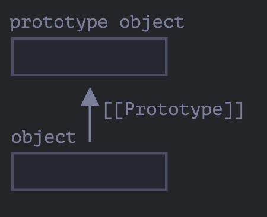
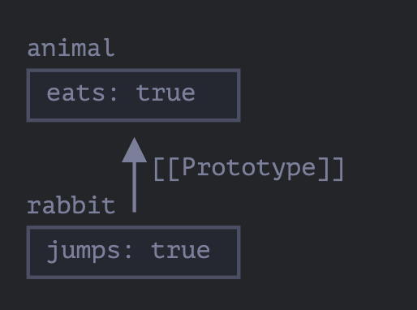

# 프로토타입의 상속에 관하여

사람에 관한 프로퍼티와 메서드를 가진 user객체가 있다고 가정.

user와 유사하지만 차이가 있는 admin, guest객체를 만들어야한다라는 문제가 있다.

이때 user의 메서드를 복사하여 재구현하지않고 user에 기능을 추가하여 admin, guest 객체를 만들고싶다는 생각이 들 것이다.

## [[Prototype]]

자바스크립트 객체에는 [[Prototype]]이라는 숨김 프로퍼티를 가지고있다.

이 프로퍼티 값은 null이거나 다른 객체에 대한 참조가 되는데 이 참조되는 대상을 **"프로토타입"**이라고 부른다.

 

<br>

object에서 프로퍼티를 읽을려고한다. 해당 프로퍼티가 없다면 자바스크립트는 자동으로 프로토타입에서 프로퍼티를 찾는다.

이런 동작 방식을 '프로토타입 상속'이라고 부른다.

> __proto__는 [[Prototype]]용 getter, setter입니다!
>
> 최근 스크립트에는 __proto__대신 Object.getPrototypeOf, Object.setPrototypeOf를 사용하여 get, set을 합니다.

<br>

예시를 보면서 이해해보자.

```js
// __proto__ 사용법
let animal = {
    eats : true
};

let rabbit = {
    jumps: true
};

rabbit.__proto__ = animal;

console.log(rabbit.eats) // true -> rabbit에는 eats라는 프로퍼티가 없지만 프로토타입 상속으로 인하여 true가 반환된다.
console.log(rabbit.jumps) // true 

```

만약 rabbit에서 프로퍼티를 얻고싶지만 해당 프로퍼티가 없다고 가정하자.

자바스크립트는 animal이라는 객체에서 프로퍼티를 얻을수있다.



<br>

위 그림은 현재 프로토타입의 상태를 보여주는 그림이다.

rabbit의 프로토타입은 animal이다. 또는 rabbit은 animal을 상속받는다 라고 말 할 수 있다.

이렇게 프로토타입에서 상속받은 프로퍼티를 '상속 프로퍼티' 라고 한다.

예시코드르 보면서 animal에 정의된 메서드를 rabbit에서 호출하여 보자.

```js
let animal = {
    eats: true,
    walk() {
        console.log('동물이 걷는다.')
    }
};

let rabbit = {
    jumps: true,
    __proto__: animal
};

rabbit.walk(); // 동물이 걷는다.
```


## 프로토타입 체이닝

프로토타입 체이닝에는 제약사항이 두가지가 존재한다.

1. 순환참조는 허용되지 않는다. __proto__를 이용하여 닫힌 형태로 다른 객체를 참조하면 에러가 발생한다.
2. __proto__값은 객체나 null만 가능하다. 다른 자료형은 무시된다.

```js
let animal = {
  eats: true,
  walk() {
    alert("동물이 걷습니다.");
  }
};

let rabbit = {
  jumps: true,
  __proto__: animal
};

let longEar = {
  earLength: 10,
  __proto__: rabbit
};


longEar.walk() // 동물이 걷습니다.
console.log(longEar.jumps) // true
```
