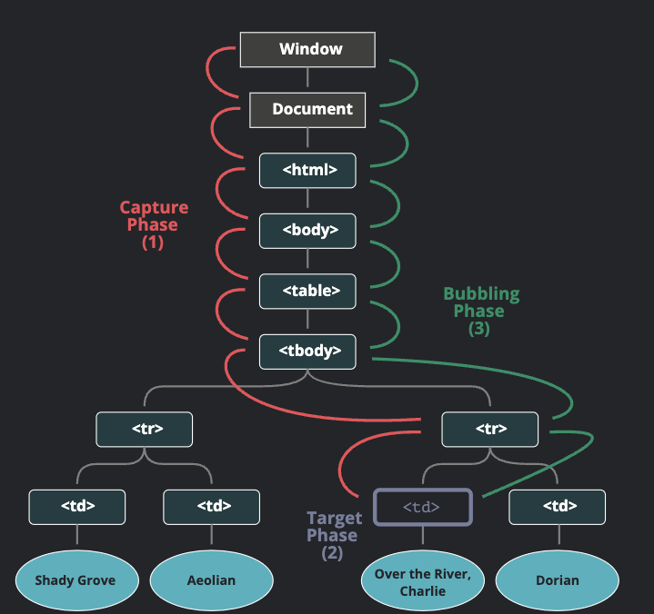

# 버블링 캡처링!

## 버블링

한 요소에 이벤트가 발생하면 , 요소에 할당된 핸들러가 동작 -> 부모 요소의 핸들러가 동작 -> 최상단의 요소를 만날 때 까지 반복됨

```html
<style>
  body * {
    margin: 10px;
    border: 1px solid blue;
  }
</style>

<form onclick="alert('form')">FORM
  <div onclick="alert('div')">DIV
    <p onclick="alert('p')">P</p>
  </div>
</form>
```

위 코드에서 만약 p태그를 클릭한다면, 

1. p에 할당된 onclick핸들러가 동작
2. div에 할당된 핸들러가 동작
3. form에 할당된 핸들러가 동작
4. document객체를 만날 때까지 onclick핸들러가 동작

> "거의" 모든 이벤트는 버블링이 된다.
>
> focus이벤트 처럼 버블링 되지 않는 이벤트도 있다.

<br>

만약 부모 요소의 핸들러는 이벤트가 정확히 어디서 발생했는지에 대한 자세한 정보를 얻을 수 있다.
이벤트가 발생한 **가장 안쪽의 요소를 타깃(target)요소라 불리고 event.target을 사용해 접근이 가능하다.**

이때 event.target과 this는 차이점이 존재한다.

- event.target은 실제 이벤트가 시작된 '타깃' 요소입니다. 버블링이 진행된다 해도 변하지 않습니다.
- this는 '현재'의 요소로 실행 중인 핸들러가 할당된 요소를 참조합니다.

<br>

## 버블링 중단

몇몇 이벤트는 window객체까지 거슬러 올라가기도 합니다. 이때 모든 핸들러가 호출이 되는 경우도 있는데 이런 불상사를 막고싶다면 어떻게 해야할까?

### event.stopPropagation()

stopPropagation를 사용한다면 버블링을 막을 수 있습니다.

### event.stopImmediatePropagation()
stopPropagation은 위쪽으로 일어나는 버블링만 막아준다. 다른 핸들러들이 동작하는 것은 막지 못한다.

버블링도 멈추고, 요소에 할당된 다른 핸들러의 동작도 막기위해서는

**event.stopImmediatePropagation()**을 사용하자.

<br>

> 꼭 필요한 경우를 제외하고 버블링을 막지마라.
>
> 버블링은 유용한 동작입니다. 
>
> 만약 클릭을 하는 서브메뉴가 있다고 가정하자. 이때 상위 메뉴 클릭 이벤트핸들러가 동작하지 않도록 stopPropagation으로 막았다.
>
> 이후 사람들이 페이지에서 어디를 클릭한지를 분석하기위해 window안에서 클릭이벤트를 전부 감지하도록 코드를 짜고 분석한다. 
>
> 이때 버블링을 막아놓은 코드는 동작하지 않기에 문제가 발생한다.
> 


<br>
<br>

## 캡처링

이벤트 종류에서는 "캡처링"라는 흐름이 존재한다.

**표준 DOM이벤트에서 정의한 이벤트 흐름은 3단계가 존재한다.**

1. 캡처링 단계 - 이벤트가 하위 요소로 전파되는 단계
2. 타깃 단계 - 이벤트가 실제 타깃 요소에 전달되는 단계
3. 버블링 단계 - 이벤트가 상위 요소로 전파되는 단계

<br>



<br>

만약 테이블 안에 td를 클릭한다면 최상위에서 부터 아래로 전파(캡처링), 이벤트가 타깃 요소에 도착해 실행(타깃 단계), 다시 위로 전파(버블링)된다.

이런 과정으로 요소에 할당된 이벤트 핸들러가 호출됩니다.

> 캡처링 단계를 이용해야 하는 경우는 흔치 않습니다! 보게 된다해도 겁먹지 맙시다!

<br>

캡처링 단계에서 이벤트를 잡아낼려면 addEventListner의 capture옵션을 true로 줍시다.

```js
elem.addEventListner(..., {capture: true})
elem.addEventListner(..., true) // 이렇게 축약해도 가능하다.

```
