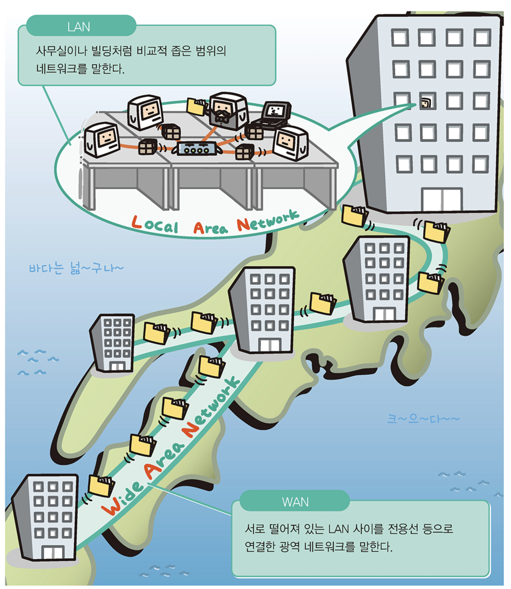
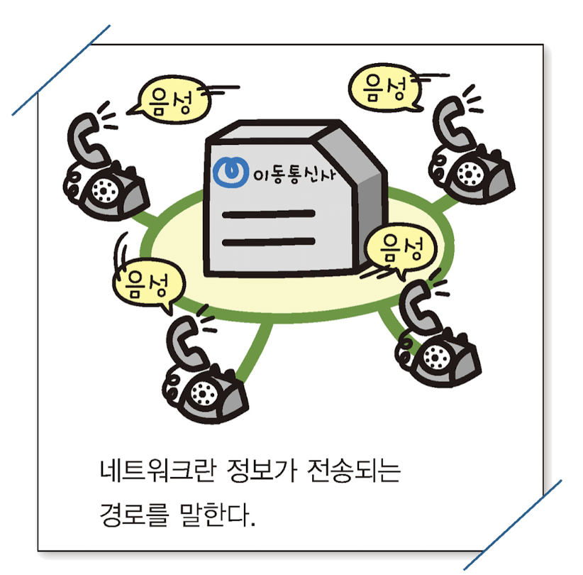
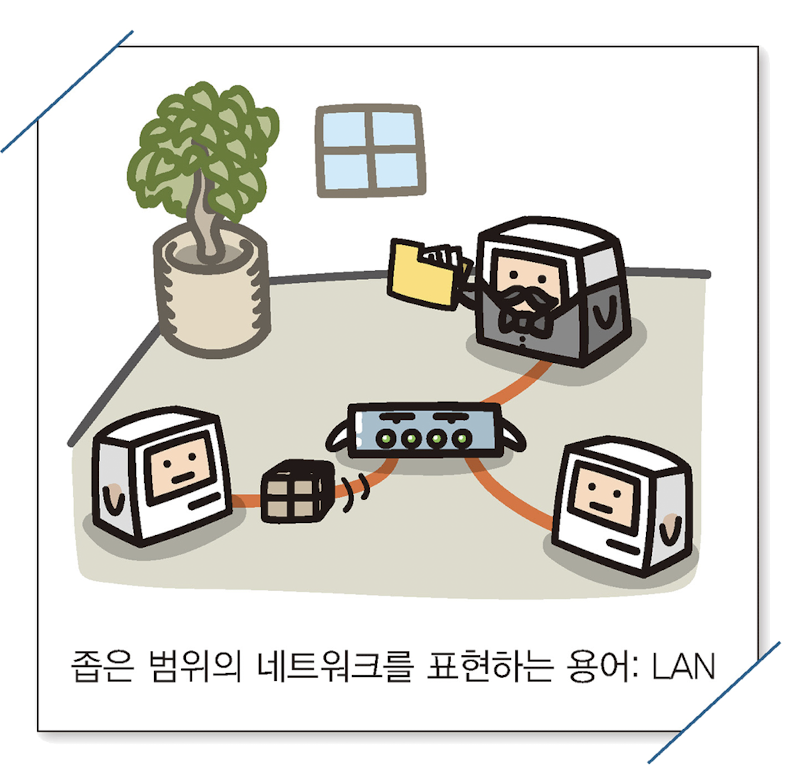
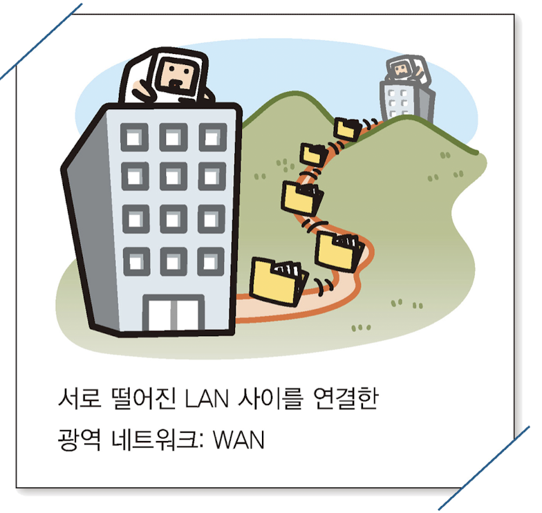

# LAN과 WAN

 

### 주제에 대한 정의

 

> LAN(Local Area Network) : 사무실이나 빌딩처럼 비교적 좁은 범위의 네트워크를 말한다.
>
> WAN(Wide Area Network) : 서로 떨어져 있는 LAN사이를 전용선 등으로 연결한 광역 네트워크를 말한다.

 

## 네트워크란?

 

**네트워크 : 정보가 전송되는 경로**

 

## LAN이란

 

 

LAN(Local Area Network) : 사무실이나 빌딩처럼 비교적 좁은 범위의 네트워크를 말한다.

LAN에는 다양한 규격이 있으며 연결형태(토폴로지)는 버스, 스타, 링 토폴로지 등이 존재하고 **스타토폴로지(허브를 사용)** 가 가장 많이 사용하는 형태이다.

LAN을 구축하는 장점 자원을 공유할 수 있다는 점.

 

## WAN이란

 

 

WAN(Wide Area Network) : 서로 떨어져 있는 LAN사이를 전용선 등으로 연결한 광역 네트워크를 말한다.

WAN의 목적은 업무상 필요한 데이터를 주고받기, 핵심 업무를 중앙에서 관리하기

인터넷도 넓은의미에서 WAN의 한 종류

요즘에는 암호화통신기술의 발달로 중간 경로에 인터넷을 사용하여 저렴하게 구축하는 사례도 있음