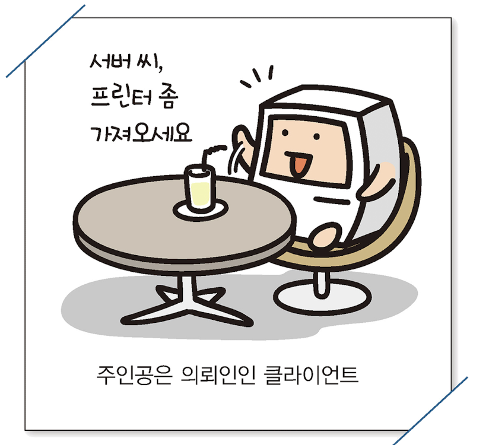
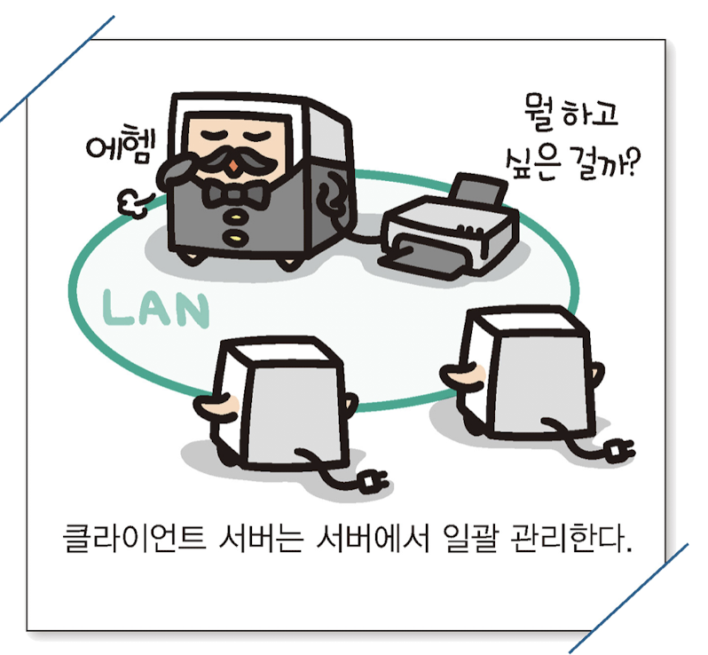

# 클라이언트와 서버

 

> 클라이언트 : 네트워크에서 서비스를 요구하는 쪽 컴퓨터를 "클라이언트"라고 부른다.
>
> 서버 : 네트워크에서 서비스를 제공하는 쪽 컴퓨터를 "서버"라고 부른다.

 
 

## 서버

 

이 책에서 소개하는 서버는 '지배인'을 의미한다.

레스토랑에서 자리를 안내하거나 메뉴를 가져다주는 역할을 네트워크에서 수행하는 것이 서버의 일이다.

 

## 클라이언트

 

이 책에서 소개하는 클라이언트는 '의뢰인'을 의미한다.

레스토랑에 온 손님처럼 이것저것 서버에게 부탁하는 일을 하는 것이 클라이언트의 일이다.

 

## Peer-to-Peer
 

 

Peer-to-Peer형태의 네트워크는 네트워크의 클라이언트가 서로 파일이나 프린터의 등의 **자원**을 공유하는 형태이다.

다른 컴퓨터의 자원을 사용할 때는 ***클라이언트*** 가 되고,  요청을 보내고 반대로 자신의 자원을 다른 컴퓨터가 사용하고싶다고 요청을 받을 때는 ***서버*** 가 된다.

이런 Peer-to-Peer형 네트워크는 각 컴퓨터가 동등한 권한을 가지고 서로 독립되어있다.

컴퓨터가 5~6대 정도의 소규모 LAN인 경우 대부분 *Peer-to-Peer* 인 형태의 네트워크이다.

 

## 클라이언트 서버

 

 

클라이언트 서버은 서버용으로 전용 컴퓨터를 설치하여 네트워크를 관리하는 방법

서버가 주체가 되며 컴퓨터가 네트워크에 접속하는 순간 서버의 허가를 받아야한다.

클라이언트 서버은 사용자에게 제한을 걸고, 네트워크에 접속 거부하는 등 유연하게 서비스의 구성을 변경할 수 있다.

어느정도 큰 규모의 네트워크라면 관리하는 노력이 줄어드는 효과가 있다.